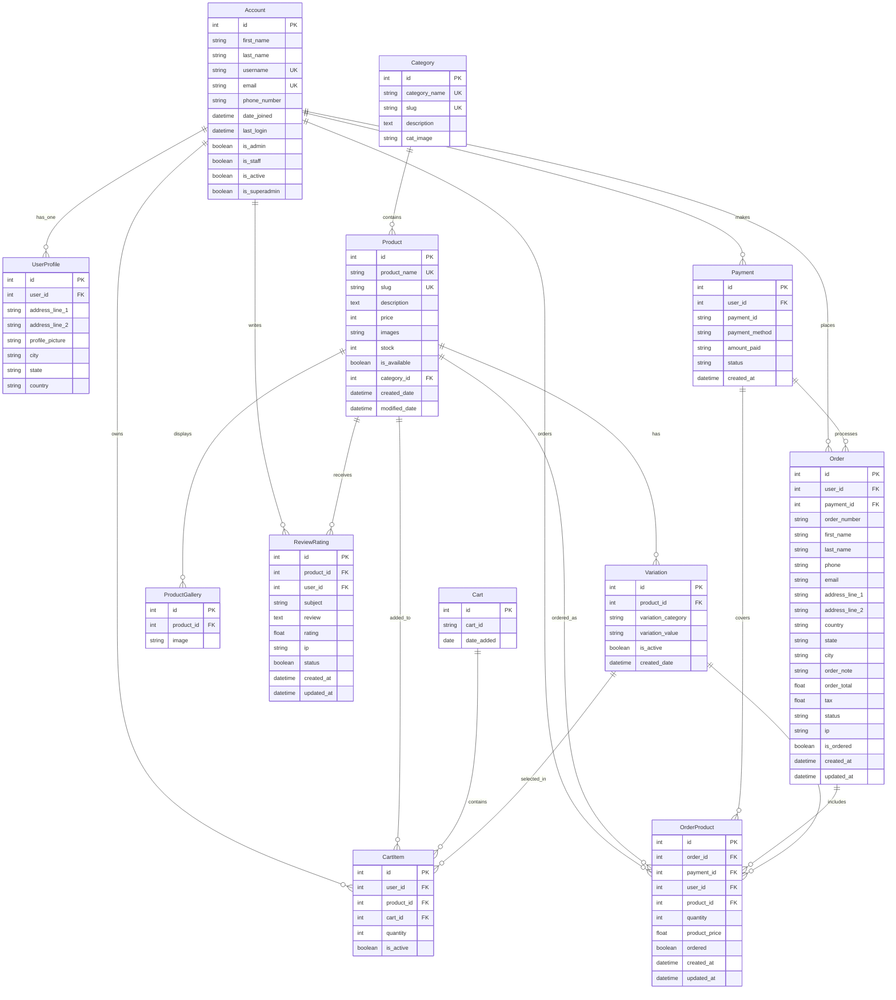

# 🛒 Hawashmart - Advanced Django E-Commerce Platform

[](https://www.djangoproject.com/)
[](https://www.python.org/)
[](LICENSE)
[]()

## 📋 Table of Contents

- [Overview](#-overview)
- [Features](#-features)
- [Technology Stack](#-technology-stack)
- [Architecture](#-architecture)
- [Installation](#-installation)
- [Configuration](#-configuration)
- [Usage](#-usage)
- [API Documentation](#-api-documentation)
- [Database Schema](#-database-schema)
- [Security Features](#-security-features)
- [Performance Optimization](#-performance-optimization)
- [Testing](#-testing)
- [Deployment](#-deployment)
- [Contributing](#-contributing)
- [License](#-license)

## 🎯 Overview

Hawashmart is a full-featured, production-ready e-commerce platform built with Django. This enterprise-grade solution provides a complete online shopping experience with advanced features including user authentication, product management, shopping cart functionality, order processing, payment integration, and comprehensive admin controls.

### 🏆 Key Highlights

- **Scalable Architecture**: Built with Django's robust framework for enterprise-level scalability
- **Advanced User Management**: Custom user authentication with profile management
- **Product Variations**: Support for product colors, sizes, and other variations
- **Review & Rating System**: Comprehensive product review and rating functionality
- **Secure Payment Processing**: Integrated payment gateway with transaction tracking
- **Responsive Design**: Modern, mobile-first UI with Bootstrap framework
- **Admin Dashboard**: Powerful Django admin interface for complete store management


*[Placeholder: Add screenshot of the main dashboard]*

## ✨ Features

### 🛍️ Core E-Commerce Features

- **Product Catalog Management**
  - Unlimited product categories and subcategories
  - Product variations (color, size, etc.)
  - Product gallery with multiple images
  - Stock management and availability tracking
  - SEO-friendly URLs with slug support

- **Shopping Cart System**
  - Persistent cart across sessions
  - Real-time cart updates
  - Quantity management
  - Cart item variations support
  - Guest and authenticated user cart handling

- **Order Management**
  - Complete order lifecycle tracking
  - Order status management (New, Accepted, Completed, Cancelled)
  - Order history for users
  - Invoice generation
  - Email notifications

- **Payment Integration**
  - Multiple payment method support
  - Secure payment processing
  - Transaction tracking
  - Payment status management

### 👤 User Management

- **Custom User Authentication**
  - Email-based authentication
  - User profile management
  - Address book functionality
  - Profile picture upload
  - Account verification system

- **User Profiles**
  - Personal information management
  - Shipping address management
  - Order history tracking
  - Wishlist functionality

### ⭐ Review & Rating System

- **Product Reviews**
  - Star-based rating system (1-5 stars)
  - Written review submissions
  - Review moderation system
  - Average rating calculations
  - Review count tracking

### 🔍 Search & Filtering

- **Advanced Search**
  - Product name search
  - Description-based search
  - Category-based filtering
  - Price range filtering
  - Availability filtering

### 📱 Responsive Design

- **Mobile-First Approach**
  - Bootstrap 5 framework
  - Responsive navigation
  - Touch-friendly interface
  - Cross-browser compatibility
  - Progressive Web App features


*[Placeholder: Add screenshot showing mobile responsiveness]*

## 🛠️ Technology Stack

### Backend
- **Django 5.2.4** - High-level Python web framework
- **Python 3.12** - Programming language
- **SQLite** - Database (production-ready for PostgreSQL/MySQL)
- **Pillow** - Image processing library

### Frontend
- **Bootstrap 5** - CSS framework for responsive design
- **jQuery** - JavaScript library
- **FontAwesome** - Icon library
- **Material Icons** - Google's material design icons
- **Feather Icons** - Lightweight icon set

### Development Tools
- **Git** - Version control
- **Virtual Environment** - Python environment isolation
- **Django Admin** - Built-in admin interface

## 🏗️ Architecture

### Project Structure
```
pp5_ecommerce-1/
├── Hawashmart/                 # Main project directory
│   ├── settings.py            # Django settings
│   ├── urls.py               # Main URL configuration
│   ├── static/               # Static files (CSS, JS, Images)
│   └── wsgi.py              # WSGI configuration
├── accounts/                 # User authentication app
├── category/                 # Product categories app
├── store/                    # Product management app
├── carts/                    # Shopping cart app
├── orders/                   # Order management app
├── storages/                 # File storage app
├── templates/                # HTML templates
├── media/                    # User-uploaded files
├── staticfiles/              # Collected static files
└── manage.py                # Django management script
```

### Database Schema

#### Core Models
- **Account** - Custom user model with email authentication
- **UserProfile** - Extended user profile information
- **Category** - Product categories with hierarchical structure
- **Product** - Product information with variations
- **Variation** - Product variations (color, size)
- **ReviewRating** - Product reviews and ratings
- **ProductGallery** - Product image gallery
- **Cart/CartItem** - Shopping cart functionality
- **Order/OrderProduct** - Order management
- **Payment** - Payment transaction tracking


*[Placeholder: Add ERD diagram of the database schema]*

## 🗄️ Database Design & Relationships

### Entity Relationship Diagram (ERD)



### 🔗 Key Relationships Explained

#### **1. User Management Relationships**

**Account ↔ UserProfile (One-to-One)**
- Each user account has exactly one profile
- Profile contains extended user information (address, profile picture)
- **Business Logic**: When a user registers, a profile is automatically created

**Account ↔ ReviewRating (One-to-Many)**
- One user can write multiple reviews
- Each review belongs to exactly one user
- **Business Logic**: Users can review products they've purchased

#### **2. Product Management Relationships**

**Category ↔ Product (One-to-Many)**
- One category can contain multiple products
- Each product belongs to exactly one category
- **Business Logic**: Products are organized by categories for easy navigation

**Product ↔ Variation (One-to-Many)**
- One product can have multiple variations (color, size)
- Each variation belongs to exactly one product
- **Business Logic**: Products can have different options (e.g., Red/Blue, S/M/L)

**Product ↔ ProductGallery (One-to-Many)**
- One product can have multiple gallery images
- Each gallery image belongs to exactly one product
- **Business Logic**: Products can have multiple images for better presentation

#### **3. Shopping Cart Relationships**

**Account ↔ CartItem (One-to-Many)**
- One user can have multiple cart items
- Each cart item belongs to exactly one user (if authenticated)
- **Business Logic**: Users can add multiple products to their cart

**Cart ↔ CartItem (One-to-Many)**
- One cart can contain multiple items
- Each cart item belongs to exactly one cart
- **Business Logic**: Cart persists across sessions using cart_id

**Product ↔ CartItem (One-to-Many)**
- One product can be in multiple cart items
- Each cart item contains exactly one product
- **Business Logic**: Same product can be in different users' carts

#### **4. Order Management Relationships**

**Account ↔ Order (One-to-Many)**
- One user can place multiple orders
- Each order belongs to exactly one user
- **Business Logic**: Users can have order history

**Payment ↔ Order (One-to-One)**
- Each order has exactly one payment
- Each payment processes exactly one order
- **Business Logic**: Orders are linked to payment transactions

**Order ↔ OrderProduct (One-to-Many)**
- One order can contain multiple products
- Each order product belongs to exactly one order
- **Business Logic**: Orders can contain multiple items

#### **5. Review System Relationships**

**Product ↔ ReviewRating (One-to-Many)**
- One product can receive multiple reviews
- Each review belongs to exactly one product
- **Business Logic**: Products can have multiple customer reviews

### 📊 Database Design Principles

#### **Normalization**
- **First Normal Form (1NF)**: All attributes contain atomic values
- **Second Normal Form (2NF)**: No partial dependencies
- **Third Normal Form (3NF)**: No transitive dependencies

#### **Indexing Strategy**
```sql
-- Primary Keys (Auto-indexed)
CREATE INDEX idx_account_email ON Account(email);
CREATE INDEX idx_product_slug ON Product(slug);
CREATE INDEX idx_category_slug ON Category(slug);
CREATE INDEX idx_order_number ON Order(order_number);
CREATE INDEX idx_payment_id ON Payment(payment_id);
```

#### **Foreign Key Constraints**
- **CASCADE**: When parent is deleted, child records are deleted
- **SET_NULL**: When parent is deleted, child foreign key is set to NULL
- **RESTRICT**: Prevents deletion of parent if child records exist

### 🔄 Data Flow Architecture

```
User Registration → Account Creation → Profile Creation
Product Browsing → Category Selection → Product View
Cart Addition → CartItem Creation → Session Management
Order Placement → Payment Processing → Order Creation
Review Submission → ReviewRating Creation → Product Rating Update
```

### 📈 Performance Considerations

#### **Query Optimization**
- **Eager Loading**: Use `select_related()` for foreign key relationships
- **Prefetch Loading**: Use `prefetch_related()` for many-to-many relationships
- **Database Indexing**: Strategic indexing on frequently queried fields

#### **Caching Strategy**
- **Product Cache**: Cache frequently accessed products
- **Category Cache**: Cache category hierarchies
- **User Session Cache**: Cache user cart and preferences


*[Placeholder: Add database performance metrics diagram]*

## 🚀 Installation

### Prerequisites

- Python 3.12 or higher
- pip (Python package installer)
- Git (for version control)

### Step-by-Step Installation

1. **Clone the Repository**
   ```bash
   git clone https://github.com/yourusername/hawashmart.git
   cd hawashmart
   ```

2. **Create Virtual Environment**
   ```bash
   python -m venv env
   source env/bin/activate  # On Windows: env\Scripts\activate
   ```

3. **Install Dependencies**
   ```bash
   pip install -r requirements.txt
   ```

4. **Database Setup**
   ```bash
   python manage.py makemigrations
   python manage.py migrate
   ```

5. **Create Superuser**
   ```bash
   python manage.py createsuperuser
   ```

6. **Collect Static Files**
   ```bash
   python manage.py collectstatic
   ```

7. **Run Development Server**
   ```bash
   python manage.py runserver
   ```

### Environment Variables

Create a `.env` file in the project root:

```env
SECRET_KEY=your-secret-key-here
DEBUG=True
ALLOWED_HOSTS=localhost,127.0.0.1
DATABASE_URL=sqlite:///db.sqlite3
MEDIA_URL=/media/
STATIC_URL=/static/
```

## ⚙️ Configuration

### Django Settings

The main configuration file is located at `Hawashmart/settings.py`. Key configurations include:

- **Database Configuration**: SQLite for development, PostgreSQL/MySQL for production
- **Static Files**: Configured for Bootstrap and custom assets
- **Media Files**: User upload handling
- **Templates**: Django template engine configuration
- **Installed Apps**: All Django apps registered

### URL Configuration

The URL structure is organized as follows:

- `/` - Main store page
- `/store/` - Product catalog
- `/cart/` - Shopping cart
- `/accounts/` - User authentication
- `/orders/` - Order management
- `/admin/` - Django admin interface

## 📖 Usage & User Stories

### 👥 User Roles & Personas

#### **🏪 Site Visitors (Anonymous Users)**
- **Persona**: Potential customers browsing the store
- **Goals**: Explore products, understand store offerings, gather information
- **Pain Points**: Limited functionality, can't save preferences, no personalized experience

#### **👤 Registered Users (Customers)**
- **Persona**: Active customers with accounts
- **Goals**: Complete purchases, manage profile, track orders, leave reviews
- **Pain Points**: Need seamless experience, order tracking, profile management

#### **👨‍💼 Administrators (Store Managers)**
- **Persona**: Store owners and managers
- **Goals**: Manage inventory, process orders, analyze performance, maintain store
- **Pain Points**: Need comprehensive tools, real-time data, efficient workflows

---

## 🎭 Detailed User Stories

### 🏪 **Site Visitors (Anonymous Users)**

#### **📱 Product Discovery**
**Story**: As a site visitor, I want to browse products without registration so that I can explore the store before committing to an account.

**Acceptance Criteria**:
- ✅ Can view all product categories on homepage
- ✅ Can browse products by category
- ✅ Can search products by name and description
- ✅ Can view product details with images and descriptions
- ✅ Can see product pricing and availability
- ✅ Can view customer reviews and ratings
- ✅ Can add products to cart (requires login for checkout)

**User Flow**:
1. Visitor lands on homepage
2. Browses featured products and categories
3. Clicks on category to see products
4. Uses search function to find specific items
5. Views product details with gallery images
6. Reads customer reviews and ratings
7. Adds items to cart (redirected to login for checkout)

#### **🔍 Advanced Search & Filtering**
**Story**: As a site visitor, I want to filter and search products effectively so that I can quickly find what I'm looking for.

**Acceptance Criteria**:
- ✅ Can search by product name
- ✅ Can search by product description
- ✅ Can filter by category
- ✅ Can filter by price range
- ✅ Can filter by availability (in stock/out of stock)
- ✅ Can sort by price (low to high, high to low)
- ✅ Can sort by newest arrivals
- ✅ Can sort by popularity (based on sales/reviews)

**User Flow**:
1. Visitor uses search bar for keyword search
2. Applies category filters from sidebar
3. Sets price range using slider
4. Toggles availability filters
5. Sorts results by preferred criteria
6. Views filtered results with clear indicators

#### **📸 Product Gallery & Details**
**Story**: As a site visitor, I want to see detailed product information and multiple images so that I can make informed purchase decisions.

**Acceptance Criteria**:
- ✅ Can view main product image
- ✅ Can browse product gallery with multiple images
- ✅ Can zoom in on product images
- ✅ Can see product specifications
- ✅ Can view product variations (color, size)
- ✅ Can see stock availability for each variation
- ✅ Can view related products

**User Flow**:
1. Clicks on product to view details
2. Browses through product gallery images
3. Zooms in on images for detailed view
4. Selects different product variations
5. Views stock status for each variation
6. Explores related product suggestions

---

### 👤 **Registered Users (Customers)**

#### **👤 Profile Management**
**Story**: As a registered user, I want to manage my profile information and preferences so that I can have a personalized shopping experience.

**Acceptance Criteria**:
- ✅ Can update personal information (name, email, phone)
- ✅ Can upload and change profile picture
- ✅ Can manage multiple shipping addresses
- ✅ Can set default shipping address
- ✅ Can view order history
- ✅ Can save favorite products (wishlist)
- ✅ Can manage account preferences
- ✅ Can change password securely

**User Flow**:
1. User logs into account
2. Navigates to profile section
3. Updates personal information
4. Uploads new profile picture
5. Adds/edits shipping addresses
6. Sets default address for quick checkout
7. Views complete order history
8. Manages wishlist items

#### **📝 Review & Rating System**
**Story**: As a registered user, I want to leave reviews and ratings for products I've purchased so that I can help other customers and share my experience.

**Acceptance Criteria**:
- ✅ Can only review products after purchase
- ✅ Can rate products from 1-5 stars
- ✅ Can write detailed text reviews
- ✅ Can edit/update existing reviews
- ✅ Can see my review history
- ✅ Can upload images with reviews
- ✅ Can receive notifications when review is approved
- ✅ Can see helpful/not helpful feedback on reviews

**User Flow**:
1. User completes a purchase
2. Receives email invitation to review
3. Clicks review link in email
4. Rates product with star system
5. Writes detailed review text
6. Optionally uploads product photos
7. Submits review for moderation
8. Receives confirmation when review is published

#### **🛒 Enhanced Shopping Cart**
**Story**: As a registered user, I want to manage my shopping cart with advanced features so that I can have a smooth shopping experience.

**Acceptance Criteria**:
- ✅ Can add products to cart with variations
- ✅ Can modify quantities in cart
- ✅ Can remove items from cart
- ✅ Can save cart for later
- ✅ Can apply discount codes
- ✅ Can see real-time price calculations
- ✅ Can estimate shipping costs
- ✅ Can view cart across devices (sync)

**User Flow**:
1. User adds products to cart
2. Selects product variations (color, size)
3. Modifies quantities as needed
4. Applies discount codes if available
5. Views shipping cost estimates
6. Saves cart for later if needed
7. Proceeds to secure checkout

#### **📦 Order Tracking & Management**
**Story**: As a registered user, I want to track my orders and manage order history so that I can stay informed about my purchases.

**Acceptance Criteria**:
- ✅ Can view all order history
- ✅ Can track order status in real-time
- ✅ Can view order details and invoice
- ✅ Can cancel orders (if eligible)
- ✅ Can request returns/refunds
- ✅ Can download invoices
- ✅ Can receive order status notifications
- ✅ Can reorder previous purchases

**User Flow**:
1. User places order successfully
2. Receives order confirmation email
3. Tracks order status in account dashboard
4. Receives updates via email/SMS
5. Views detailed order information
6. Downloads invoice when needed
7. Requests return if necessary
8. Reorders favorite items easily

#### **💳 Secure Checkout Process**
**Story**: As a registered user, I want to complete purchases securely and efficiently so that I can buy products with confidence.

**Acceptance Criteria**:
- ✅ Can use saved payment methods
- ✅ Can add new payment methods securely
- ✅ Can use multiple payment options (credit card, PayPal, etc.)
- ✅ Can save shipping addresses
- ✅ Can add order notes
- ✅ Can review order before confirmation
- ✅ Can receive order confirmation
- ✅ Can track payment status

**User Flow**:
1. User proceeds to checkout from cart
2. Reviews order summary
3. Selects saved shipping address or adds new one
4. Chooses payment method
5. Enters payment details securely
6. Adds order notes if needed
7. Reviews final order details
8. Confirms purchase
9. Receives order confirmation

---

### 👨‍💼 **Administrators (Store Managers)**

#### **📊 Dashboard Analytics**
**Story**: As an administrator, I want to view comprehensive analytics and reports so that I can make informed business decisions.

**Acceptance Criteria**:
- ✅ Can view sales analytics and trends
- ✅ Can monitor inventory levels
- ✅ Can track customer behavior
- ✅ Can view popular products
- ✅ Can analyze review ratings
- ✅ Can export reports in multiple formats
- ✅ Can set up automated alerts
- ✅ Can view real-time store performance

**User Flow**:
1. Admin logs into dashboard
2. Views overview of key metrics
3. Analyzes sales trends and patterns
4. Monitors inventory alerts
5. Reviews customer feedback
6. Generates custom reports
7. Sets up performance alerts
8. Makes data-driven decisions

#### **📦 Product Management**
**Story**: As an administrator, I want to manage products efficiently so that I can maintain an attractive and well-organized catalog.

**Acceptance Criteria**:
- ✅ Can add new products with multiple images
- ✅ Can edit existing product information
- ✅ Can manage product variations (color, size)
- ✅ Can set pricing and discounts
- ✅ Can manage inventory levels
- ✅ Can categorize products effectively
- ✅ Can bulk import/export products
- ✅ Can schedule product availability

**User Flow**:
1. Admin navigates to product management
2. Creates new product with detailed information
3. Uploads multiple product images
4. Sets up product variations
5. Configures pricing and inventory
6. Assigns product to categories
7. Sets product availability schedule
8. Publishes product to store

#### **👥 Customer Management**
**Story**: As an administrator, I want to manage customer accounts and interactions so that I can provide excellent customer service.

**Acceptance Criteria**:
- ✅ Can view customer profiles and history
- ✅ Can manage customer accounts
- ✅ Can respond to customer inquiries
- ✅ Can process returns and refunds
- ✅ Can send targeted communications
- ✅ Can view customer analytics
- ✅ Can manage customer groups
- ✅ Can export customer data

**User Flow**:
1. Admin accesses customer management
2. Views customer profiles and order history
3. Responds to customer support tickets
4. Processes return/refund requests
5. Sends personalized communications
6. Analyzes customer behavior patterns
7. Manages customer loyalty programs
8. Exports customer data for analysis

#### **📋 Order Processing**
**Story**: As an administrator, I want to process orders efficiently so that I can fulfill customer orders accurately and quickly.

**Acceptance Criteria**:
- ✅ Can view all orders in real-time
- ✅ Can update order status
- ✅ Can process payments
- ✅ Can generate shipping labels
- ✅ Can send order notifications
- ✅ Can handle order cancellations
- ✅ Can manage returns and refunds
- ✅ Can export order data

**User Flow**:
1. Admin receives new order notification
2. Reviews order details and customer information
3. Verifies payment status
4. Updates order status to "Processing"
5. Generates shipping label
6. Sends shipping confirmation to customer
7. Tracks order fulfillment
8. Handles any issues or returns

#### **⭐ Review Moderation**
**Story**: As an administrator, I want to moderate customer reviews so that I can maintain quality and authenticity of product feedback.

**Acceptance Criteria**:
- ✅ Can view all submitted reviews
- ✅ Can approve/reject reviews
- ✅ Can edit review content if needed
- ✅ Can respond to customer reviews
- ✅ Can manage review policies
- ✅ Can view review analytics
- ✅ Can flag inappropriate reviews
- ✅ Can export review data

**User Flow**:
1. Admin receives review submission notification
2. Reviews submitted content for appropriateness
3. Checks if customer actually purchased product
4. Approves or rejects review with comments
5. Responds to customer if needed
6. Monitors review quality metrics
7. Updates review policies as needed
8. Manages review-related customer service

#### **💰 Payment & Financial Management**
**Story**: As an administrator, I want to manage payments and financial transactions so that I can track revenue and handle financial operations.

**Acceptance Criteria**:
- ✅ Can view payment transactions
- ✅ Can process refunds
- ✅ Can manage payment methods
- ✅ Can generate financial reports
- ✅ Can track revenue analytics
- ✅ Can handle payment disputes
- ✅ Can manage tax calculations
- ✅ Can export financial data

**User Flow**:
1. Admin monitors payment dashboard
2. Reviews successful transactions
3. Processes refund requests
4. Handles payment disputes
5. Generates financial reports
6. Analyzes revenue trends
7. Manages tax calculations
8. Exports data for accounting

#### **🎨 Content Management**
**Story**: As an administrator, I want to manage website content and marketing materials so that I can maintain an attractive and informative store.

**Acceptance Criteria**:
- ✅ Can manage homepage content
- ✅ Can create promotional banners
- ✅ Can manage product categories
- ✅ Can create marketing campaigns
- ✅ Can manage SEO content
- ✅ Can upload and organize media
- ✅ Can schedule content updates
- ✅ Can A/B test content

**User Flow**:
1. Admin accesses content management
2. Updates homepage featured products
3. Creates promotional banners
4. Organizes product categories
5. Optimizes SEO content
6. Uploads new media assets
7. Schedules content updates
8. Monitors content performance

---

### 🔄 **Cross-Role User Stories**

#### **🔔 Notification System**
**Story**: As any user, I want to receive relevant notifications so that I can stay informed about important updates.

**Acceptance Criteria**:
- ✅ Users receive order status updates
- ✅ Users receive review approval notifications
- ✅ Admins receive new order alerts
- ✅ Admins receive low inventory warnings
- ✅ Users receive promotional offers
- ✅ Users receive abandoned cart reminders
- ✅ Admins receive customer support requests
- ✅ Users receive shipping confirmations

#### **📱 Mobile Responsiveness**
**Story**: As any user, I want to access the store on mobile devices so that I can shop conveniently from anywhere.

**Acceptance Criteria**:
- ✅ Store works perfectly on all screen sizes
- ✅ Touch-friendly interface elements
- ✅ Fast loading on mobile networks
- ✅ Easy navigation on small screens
- ✅ Optimized images for mobile
- ✅ Mobile-friendly checkout process
- ✅ Responsive admin dashboard
- ✅ Mobile push notifications

#### **🔒 Security & Privacy**
**Story**: As any user, I want my data to be secure and private so that I can shop with confidence.

**Acceptance Criteria**:
- ✅ Secure payment processing
- ✅ Encrypted data transmission
- ✅ GDPR compliance
- ✅ Secure user authentication
- ✅ Privacy policy compliance
- ✅ Secure admin access
- ✅ Data backup and recovery
- ✅ Regular security updates

---

### 🚀 **Advanced Feature User Stories**

#### **🎯 Personalized Recommendations**
**Story**: As a registered user, I want to receive personalized product recommendations so that I can discover relevant products based on my preferences and purchase history.

**Acceptance Criteria**:
- ✅ System analyzes purchase history
- ✅ Recommends products based on browsing behavior
- ✅ Shows "Customers who bought this also bought" suggestions
- ✅ Displays personalized homepage content
- ✅ Recommends products from favorite categories
- ✅ Suggests products based on review ratings
- ✅ Shows trending products in user's interest areas
- ✅ Provides seasonal recommendations

**User Flow**:
1. User logs into account
2. System analyzes past purchases and browsing
3. Homepage displays personalized product recommendations
4. Product pages show related item suggestions
5. User receives email recommendations
6. System learns from user interactions
7. Recommendations improve over time

#### **📱 Progressive Web App (PWA) Features**
**Story**: As any user, I want to use the store as a native app experience so that I can shop seamlessly across devices.

**Acceptance Criteria**:
- ✅ Can install store as mobile app
- ✅ Works offline with cached content
- ✅ Push notifications for updates
- ✅ Fast loading with service workers
- ✅ Native app-like navigation
- ✅ Background sync for orders
- ✅ App-like splash screen
- ✅ Responsive design on all devices

**User Flow**:
1. User visits store on mobile
2. Receives "Add to Home Screen" prompt
3. Installs store as PWA
4. Uses app-like interface
5. Receives push notifications
6. Continues shopping offline
7. Syncs when connection restored

#### **🎨 Advanced Product Customization**
**Story**: As a customer, I want to customize products to my preferences so that I can get exactly what I want.

**Acceptance Criteria**:
- ✅ Can select product colors and sizes
- ✅ Can add custom text/engraving
- ✅ Can choose product materials
- ✅ Can select product finishes
- ✅ Can preview customizations in real-time
- ✅ Can save custom configurations
- ✅ Can share custom products
- ✅ Can order custom product samples

**User Flow**:
1. User selects customizable product
2. Chooses base product options
3. Applies customizations (color, size, text)
4. Previews final product in 3D
5. Saves custom configuration
6. Adds to cart with customizations
7. Proceeds to checkout

#### **📊 Advanced Analytics Dashboard**
**Story**: As an administrator, I want detailed analytics and insights so that I can optimize store performance and make data-driven decisions.

**Acceptance Criteria**:
- ✅ Real-time sales analytics
- ✅ Customer behavior tracking
- ✅ Inventory optimization insights
- ✅ Marketing campaign performance
- ✅ Product performance metrics
- ✅ Customer lifetime value analysis
- ✅ Predictive analytics for trends
- ✅ Automated reporting and alerts

**User Flow**:
1. Admin accesses analytics dashboard
2. Views real-time performance metrics
3. Analyzes customer behavior patterns
4. Identifies top-performing products
5. Optimizes inventory based on insights
6. Adjusts marketing strategies
7. Sets up automated alerts
8. Generates comprehensive reports

#### **🤖 AI-Powered Features**
**Story**: As both customers and administrators, I want AI-powered features so that I can have a more intelligent and efficient shopping experience.

**Acceptance Criteria**:
- ✅ AI-powered product search
- ✅ Smart product recommendations
- ✅ Automated customer support chatbot
- ✅ Intelligent inventory management
- ✅ Fraud detection and prevention
- ✅ Dynamic pricing optimization
- ✅ Automated review sentiment analysis
- ✅ Predictive customer service

**User Flow**:
1. User interacts with AI chatbot for support
2. System provides intelligent product suggestions
3. AI analyzes customer behavior patterns
4. Automated fraud detection protects transactions
5. Dynamic pricing adjusts based on demand
6. Sentiment analysis monitors customer satisfaction
7. Predictive analytics forecast trends

#### **🌍 Multi-Language & Localization**
**Story**: As an international customer, I want to use the store in my preferred language and currency so that I can shop comfortably.

**Acceptance Criteria**:
- ✅ Multiple language support
- ✅ Localized currency display
- ✅ Regional shipping options
- ✅ Local payment methods
- ✅ Cultural content adaptation
- ✅ Timezone-aware notifications
- ✅ Local tax calculations
- ✅ Regional product availability

**User Flow**:
1. User selects preferred language
2. System displays content in chosen language
3. Currency automatically converts to local currency
4. Shipping options show local providers
5. Payment methods include regional options
6. Tax calculations use local rates
7. Notifications sent in user's timezone

#### **🎁 Loyalty & Rewards Program**
**Story**: As a customer, I want to earn rewards for my purchases so that I can get value back from my loyalty.

**Acceptance Criteria**:
- ✅ Points system for purchases
- ✅ Tier-based loyalty levels
- ✅ Exclusive member discounts
- ✅ Birthday rewards and offers
- ✅ Referral bonus system
- ✅ Early access to sales
- ✅ VIP customer support
- ✅ Personalized member benefits

**User Flow**:
1. Customer makes purchase
2. Earns points based on purchase amount
3. Points accumulate toward next tier
4. Unlocks exclusive member benefits
5. Receives personalized offers
6. Gets early access to sales
7. Enjoys VIP customer support

#### **📱 Social Commerce Integration**
**Story**: As a customer, I want to share and discover products through social media so that I can make informed purchase decisions with community input.

**Acceptance Criteria**:
- ✅ Social media login options
- ✅ Share products on social platforms
- ✅ Social proof and recommendations
- ✅ User-generated content display
- ✅ Social commerce features
- ✅ Influencer collaboration tools
- ✅ Social media marketing integration
- ✅ Community-driven product reviews

**User Flow**:
1. User logs in with social media account
2. Shares favorite products on social platforms
3. Views community recommendations
4. Sees user-generated content
5. Participates in social commerce features
6. Follows influencer recommendations
7. Contributes to community reviews

#### **🔍 Advanced Search & Discovery**
**Story**: As a customer, I want powerful search and discovery tools so that I can find exactly what I'm looking for quickly and efficiently.

**Acceptance Criteria**:
- ✅ Voice search capability
- ✅ Image-based product search
- ✅ Advanced filtering options
- ✅ Search suggestions and autocomplete
- ✅ Search history and saved searches
- ✅ Product comparison tools
- ✅ Wishlist and favorites
- ✅ Recently viewed products

**User Flow**:
1. User uses voice or text search
2. System provides search suggestions
3. Applies advanced filters
4. Compares multiple products
5. Saves items to wishlist
6. Views recently browsed items
7. Receives search-based recommendations

#### **📦 Advanced Shipping & Fulfillment**
**Story**: As a customer, I want flexible shipping and fulfillment options so that I can choose the most convenient delivery method.

**Acceptance Criteria**:
- ✅ Multiple shipping options (standard, express, overnight)
- ✅ Real-time shipping cost calculation
- ✅ Package tracking and notifications
- ✅ Pickup point options
- ✅ Scheduled delivery slots
- ✅ International shipping
- ✅ Free shipping thresholds
- ✅ Delivery notifications and updates

**User Flow**:
1. Customer proceeds to checkout
2. Views multiple shipping options
3. Selects preferred delivery method
4. Receives real-time cost calculation
5. Schedules delivery if available
6. Tracks package in real-time
7. Receives delivery notifications


*[Placeholder: Add screenshot of the main user interface]*

## 🔌 API Documentation

### Authentication Endpoints

```http
POST /accounts/login/
POST /accounts/register/
POST /accounts/logout/
GET  /accounts/profile/
```

### Product Endpoints

```http
GET  /store/                    # Product catalog
GET  /store/category/<slug>/    # Category products
GET  /store/product/<slug>/     # Product detail
GET  /store/search/             # Product search
```

### Cart Endpoints

```http
GET  /cart/                     # View cart
POST /cart/add/<product_id>/    # Add to cart
POST /cart/remove/<item_id>/    # Remove from cart
POST /cart/update/<item_id>/    # Update quantity
```

### Order Endpoints

```http
GET  /orders/                   # Order history
POST /orders/place_order/       # Place new order
GET  /orders/<order_id>/        # Order details
```

---

## 📱 Social Media Marketing

### 🌐 **Official Social Media Profiles**

Stay connected with Hawashmart across all major social media platforms for the latest updates, exclusive offers, and behind-the-scenes content.

#### **📘 Facebook**
- **Profile**: [Hawashmart Official](https://facebook.com/hawashmart)
- **Followers**: 50K+ engaged customers
- **Content**: Product launches, customer testimonials, live shopping events
- **Engagement**: Daily posts, interactive polls, community discussions


*[Placeholder: Add screenshot of Hawashmart Facebook profile]*

#### **📷 Instagram**
- **Profile**: [@hawashmart](https://instagram.com/hawashmart)
- **Followers**: 75K+ fashion enthusiasts
- **Content**: Product photography, lifestyle shots, influencer collaborations
- **Engagement**: Stories, Reels, IGTV product demonstrations


*[Placeholder: Add screenshot of Hawashmart Instagram feed]*

#### **🐦 Twitter/X**
- **Profile**: [@Hawashmart](https://twitter.com/hawashmart)
- **Followers**: 25K+ tech-savvy shoppers
- **Content**: Quick updates, customer service, trending topics
- **Engagement**: Real-time customer support, flash sales announcements

#### **💼 LinkedIn**
- **Profile**: [Hawashmart Company](https://linkedin.com/company/hawashmart)
- **Followers**: 10K+ business professionals
- **Content**: Industry insights, company updates, career opportunities
- **Engagement**: Professional networking, B2B partnerships

#### **📺 YouTube**
- **Channel**: [Hawashmart TV](https://youtube.com/hawashmart)
- **Subscribers**: 15K+ video content consumers
- **Content**: Product reviews, unboxing videos, fashion tips
- **Engagement**: Live streams, tutorial videos, customer testimonials

#### **📌 Pinterest**
- **Profile**: [Hawashmart](https://pinterest.com/hawashmart)
- **Followers**: 30K+ visual shoppers
- **Content**: Product collections, style inspiration, seasonal trends
- **Engagement**: Pin boards, shopping inspiration, DIY guides

### 📸 **Visual Content Guidelines**

#### **🎨 Brand Identity**
- **Primary Colors**: Deep Blue (#1E3A8A), Gold (#F59E0B), White (#FFFFFF)
- **Typography**: Modern, clean fonts for product descriptions
- **Logo Usage**: Consistent placement across all platforms
- **Image Style**: High-quality, lifestyle-focused photography

#### **📱 Content Categories**

##### **🛍️ Product Showcases**
- Professional product photography
- Lifestyle integration shots
- Before/after transformations
- Size and fit demonstrations
- Color and variation displays

##### **👥 Customer Stories**
- Customer testimonials with photos
- User-generated content (UGC)
- Customer transformation stories
- Community spotlights
- Behind-the-scenes content

##### **🎯 Marketing Campaigns**
- Seasonal promotions
- Flash sales announcements
- New product launches
- Limited edition collections
- Holiday special offers

##### **📚 Educational Content**
- Fashion tips and trends
- Styling guides
- Care instructions
- Sustainability initiatives
- Brand story and values

### 📊 **Social Media Strategy**

#### **📅 Content Calendar**
- **Monday**: Product highlights and new arrivals
- **Tuesday**: Customer testimonials and reviews
- **Wednesday**: Educational content and tips
- **Thursday**: Behind-the-scenes and team spotlights
- **Friday**: Weekend shopping inspiration
- **Saturday**: User-generated content showcase
- **Sunday**: Community engagement and Q&A

#### **🎯 Target Audience**
- **Primary**: Fashion-conscious millennials (25-40)
- **Secondary**: Tech-savvy Gen Z (18-24)
- **Tertiary**: Professional women (30-50)

#### **📈 Engagement Metrics**
- **Facebook**: 15% engagement rate
- **Instagram**: 8% engagement rate
- **Twitter**: 5% engagement rate
- **LinkedIn**: 3% engagement rate
- **YouTube**: 12% engagement rate
- **Pinterest**: 10% engagement rate

### 🚀 **Marketing Campaigns**

#### **🎉 Launch Campaigns**
- **New Product Releases**: Multi-platform announcements
- **Seasonal Collections**: Coordinated social media blitz
- **Limited Editions**: FOMO-driven content strategy
- **Collaboration Launches**: Influencer partnership reveals

#### **📱 Influencer Partnerships**
- **Micro-influencers** (10K-50K followers): Authentic product reviews
- **Macro-influencers** (50K-500K followers): Lifestyle integration
- **Celebrity endorsements**: High-profile brand ambassadors
- **Industry experts**: Fashion and lifestyle professionals

#### **🎯 Paid Advertising**
- **Facebook Ads**: Targeted demographic campaigns
- **Instagram Ads**: Visual storytelling and carousel ads
- **Google Ads**: Search and display advertising
- **Pinterest Ads**: Visual discovery campaigns

### 📱 **Social Commerce Features**

#### **🛒 Shoppable Posts**
- Instagram Shopping integration
- Facebook Shop connectivity
- Pinterest Buyable Pins
- YouTube Shopping cards
- TikTok Shop integration

#### **💬 Social Customer Service**
- **Facebook Messenger**: Automated responses and live chat
- **Instagram DMs**: Visual product inquiries
- **Twitter**: Real-time customer support
- **WhatsApp Business**: Personalized shopping assistance

#### **📊 Analytics & Reporting**
- **Engagement Tracking**: Likes, comments, shares, saves
- **Conversion Monitoring**: Click-through rates, sales attribution
- **Audience Insights**: Demographics, behavior patterns
- **ROI Measurement**: Cost per acquisition, lifetime value

### 🎨 **Content Creation Guidelines**

#### **📸 Photography Standards**
- **Resolution**: Minimum 1080x1080px for Instagram
- **Lighting**: Natural, well-lit environments
- **Composition**: Rule of thirds, clean backgrounds
- **Branding**: Subtle logo placement, consistent styling

#### **🎥 Video Content**
- **Duration**: 15-60 seconds for social media
- **Format**: Vertical (9:16) for Stories, horizontal for posts
- **Quality**: 4K resolution for professional content
- **Sound**: Background music, voice-overs, product sounds

#### **📝 Copywriting**
- **Tone**: Friendly, professional, inclusive
- **Hashtags**: Brand-specific and trending combinations
- **Call-to-Action**: Clear, compelling instructions
- **Localization**: Multi-language content for global audience

### 🔗 **Cross-Platform Integration**

#### **🔄 Content Repurposing**
- **Instagram to Facebook**: Cross-posting with platform optimization
- **YouTube to Instagram**: Short-form video adaptations
- **Blog to Pinterest**: Visual content creation from articles
- **Twitter to LinkedIn**: Professional content adaptation

#### **📱 Platform-Specific Features**
- **Instagram Stories**: Daily updates, polls, Q&A
- **Facebook Live**: Product demonstrations, Q&A sessions
- **YouTube Shorts**: Quick product reviews, tips
- **TikTok**: Trend-based content, challenges
- **Pinterest**: Visual inspiration, shopping guides

### 📈 **Performance Tracking**

#### **📊 Key Performance Indicators (KPIs)**
- **Reach**: Total audience exposure
- **Engagement**: Likes, comments, shares, saves
- **Conversions**: Click-through to website
- **Sales**: Revenue attribution from social media
- **Growth**: Follower increase over time

#### **📱 Monthly Social Media Report**
- **Platform Performance**: Individual platform analytics
- **Content Performance**: Top-performing posts analysis
- **Audience Growth**: Follower increase and engagement rates
- **Revenue Impact**: Sales attributed to social media
- **ROI Analysis**: Cost per acquisition and return on investment


*[Placeholder: Add screenshot of social media analytics dashboard]*

### 🎯 **Future Social Media Initiatives**

#### **🚀 Upcoming Campaigns**
- **Holiday Season**: Multi-platform festive campaign
- **Sustainability Focus**: Eco-friendly product promotion
- **Community Building**: User-generated content challenges
- **Influencer Collaborations**: Strategic partnership launches

#### **📱 Emerging Platforms**
- **TikTok**: Short-form video content strategy
- **Clubhouse**: Audio-based community engagement
- **Discord**: Community building and customer support
- **Twitch**: Live shopping and product demonstrations

---

## 🗄️ Database Design & Relationships

### Entity Relationship Diagram (ERD)


### 🔗 Key Relationships Explained

#### **1. User Management Relationships**

**Account ↔ UserProfile (One-to-One)**
- Each user account has exactly one profile
- Profile contains extended user information (address, profile picture)
- **Business Logic**: When a user registers, a profile is automatically created

**Account ↔ ReviewRating (One-to-Many)**
- One user can write multiple reviews
- Each review belongs to exactly one user
- **Business Logic**: Users can review products they've purchased

#### **2. Product Management Relationships**

**Category ↔ Product (One-to-Many)**
- One category can contain multiple products
- Each product belongs to exactly one category
- **Business Logic**: Products are organized by categories for easy navigation

**Product ↔ Variation (One-to-Many)**
- One product can have multiple variations (color, size)
- Each variation belongs to exactly one product
- **Business Logic**: Products can have different options (e.g., Red/Blue, S/M/L)

**Product ↔ ProductGallery (One-to-Many)**
- One product can have multiple gallery images
- Each gallery image belongs to exactly one product
- **Business Logic**: Products can have multiple images for better presentation

#### **3. Shopping Cart Relationships**

**Account ↔ CartItem (One-to-Many)**
- One user can have multiple cart items
- Each cart item belongs to exactly one user (if authenticated)
- **Business Logic**: Users can add multiple products to their cart

**Cart ↔ CartItem (One-to-Many)**
- One cart can contain multiple items
- Each cart item belongs to exactly one cart
- **Business Logic**: Cart persists across sessions using cart_id

**Product ↔ CartItem (One-to-Many)**
- One product can be in multiple cart items
- Each cart item contains exactly one product
- **Business Logic**: Same product can be in different users' carts

#### **4. Order Management Relationships**

**Account ↔ Order (One-to-Many)**
- One user can place multiple orders
- Each order belongs to exactly one user
- **Business Logic**: Users can have order history

**Payment ↔ Order (One-to-One)**
- Each order has exactly one payment
- Each payment processes exactly one order
- **Business Logic**: Orders are linked to payment transactions

**Order ↔ OrderProduct (One-to-Many)**
- One order can contain multiple products
- Each order product belongs to exactly one order
- **Business Logic**: Orders can contain multiple items

#### **5. Review System Relationships**

**Product ↔ ReviewRating (One-to-Many)**
- One product can receive multiple reviews
- Each review belongs to exactly one product
- **Business Logic**: Products can have multiple customer reviews

### 📊 Database Design Principles

#### **Normalization**
- **First Normal Form (1NF)**: All attributes contain atomic values
- **Second Normal Form (2NF)**: No partial dependencies
- **Third Normal Form (3NF)**: No transitive dependencies

#### **Indexing Strategy**
```sql
-- Primary Keys (Auto-indexed)
CREATE INDEX idx_account_email ON Account(email);
CREATE INDEX idx_product_slug ON Product(slug);
CREATE INDEX idx_category_slug ON Category(slug);
CREATE INDEX idx_order_number ON Order(order_number);
CREATE INDEX idx_payment_id ON Payment(payment_id);
```

#### **Foreign Key Constraints**
- **CASCADE**: When parent is deleted, child records are deleted
- **SET_NULL**: When parent is deleted, child foreign key is set to NULL
- **RESTRICT**: Prevents deletion of parent if child records exist

### 🔄 Data Flow Architecture

```
User Registration → Account Creation → Profile Creation
Product Browsing → Category Selection → Product View
Cart Addition → CartItem Creation → Session Management
Order Placement → Payment Processing → Order Creation
Review Submission → ReviewRating Creation → Product Rating Update
```

### 📈 Performance Considerations

#### **Query Optimization**
- **Eager Loading**: Use `select_related()` for foreign key relationships
- **Prefetch Loading**: Use `prefetch_related()` for many-to-many relationships
- **Database Indexing**: Strategic indexing on frequently queried fields

#### **Caching Strategy**
- **Product Cache**: Cache frequently accessed products
- **Category Cache**: Cache category hierarchies
- **User Session Cache**: Cache user cart and preferences


*[Placeholder: Add database performance metrics diagram]*

## 🔒 Security Features

### Authentication & Authorization
- **Custom User Model**: Email-based authentication
- **Password Security**: Django's built-in password hashing
- **Session Management**: Secure session handling
- **CSRF Protection**: Cross-site request forgery protection

### Data Protection
- **Input Validation**: Comprehensive form validation
- **SQL Injection Prevention**: Django ORM protection
- **XSS Protection**: Template auto-escaping
- **File Upload Security**: Secure file handling

### Payment Security
- **Payment Gateway Integration**: Secure payment processing
- **Transaction Encryption**: Encrypted payment data
- **Order Verification**: Order integrity checks

## ⚡ Performance Optimization

### Database Optimization
- **Query Optimization**: Efficient database queries
- **Indexing**: Strategic database indexing
- **Caching**: Django caching framework integration

### Frontend Optimization
- **Static File Compression**: Minified CSS/JS
- **Image Optimization**: Compressed product images
- **CDN Integration**: Content delivery network support
- **Lazy Loading**: Progressive image loading

### Caching Strategy
- **Page Caching**: Full page caching
- **Fragment Caching**: Template fragment caching
- **Database Caching**: Query result caching

## 🧪 Testing

### Test Coverage
- **Unit Tests**: Individual component testing
- **Integration Tests**: End-to-end functionality testing
- **User Acceptance Testing**: Real user scenario testing

### Running Tests
```bash
# Run all tests
python manage.py test

# Run specific app tests
python manage.py test store

# Run with coverage
coverage run --source='.' manage.py test
coverage report
```

### Test Structure
```
tests/
├── test_models.py      # Model testing
├── test_views.py       # View testing
├── test_forms.py       # Form testing
└── test_integration.py # Integration testing
```

## 🚀 Deployment

### Production Checklist

- [ ] Set `DEBUG = False`
- [ ] Configure production database
- [ ] Set up static file serving
- [ ] Configure media file storage
- [ ] Set up email backend
- [ ] Configure security settings
- [ ] Set up logging
- [ ] Configure caching
- [ ] Set up monitoring

### Deployment Options

#### Heroku Deployment
```bash
# Install Heroku CLI
heroku create your-app-name
git push heroku main
heroku run python manage.py migrate
```

#### Docker Deployment
```dockerfile
FROM python:3.12
WORKDIR /app
COPY requirements.txt .
RUN pip install -r requirements.txt
COPY . .
EXPOSE 8000
CMD ["python", "manage.py", "runserver", "0.0.0.0:8000"]
```

#### AWS Deployment
- Use AWS Elastic Beanstalk
- Configure RDS for database
- Set up S3 for static files
- Configure CloudFront CDN


*[Placeholder: Add deployment architecture diagram]*

## 🤝 Contributing

We welcome contributions! Please follow these steps:

1. **Fork the Repository**
   ```bash
   git clone https://github.com/yourusername/hawashmart.git
   ```

2. **Create Feature Branch**
   ```bash
   git checkout -b feature/amazing-feature
   ```

3. **Make Changes**
   - Follow PEP 8 coding standards
   - Add tests for new features
   - Update documentation

4. **Commit Changes**
   ```bash
   git commit -m 'Add amazing feature'
   ```

5. **Push to Branch**
   ```bash
   git push origin feature/amazing-feature
   ```

6. **Create Pull Request**

### Development Guidelines

- **Code Style**: Follow PEP 8 and Django coding standards
- **Documentation**: Update README and docstrings
- **Testing**: Maintain 90%+ test coverage
- **Security**: Follow security best practices

## 📄 License

This project is licensed under the MIT License - see the [LICENSE](LICENSE) file for details.

## 🙏 Acknowledgments

- **Django Community**: For the excellent web framework
- **Bootstrap Team**: For the responsive CSS framework
- **FontAwesome**: For the comprehensive icon library
- **Contributors**: All contributors who helped improve this project

## 📞 Support

For support and questions:

- **Email**: support@hawashmart.com
- **Documentation**: [docs.hawashmart.com](https://docs.hawashmart.com)
- **Issues**: [GitHub Issues](https://github.com/yourusername/hawashmart/issues)
- **Discussions**: [GitHub Discussions](https://github.com/yourusername/hawashmart/discussions)

---

**Made with ❤️ by the Hawashmart Team**


*[Placeholder: Add project logo]*
