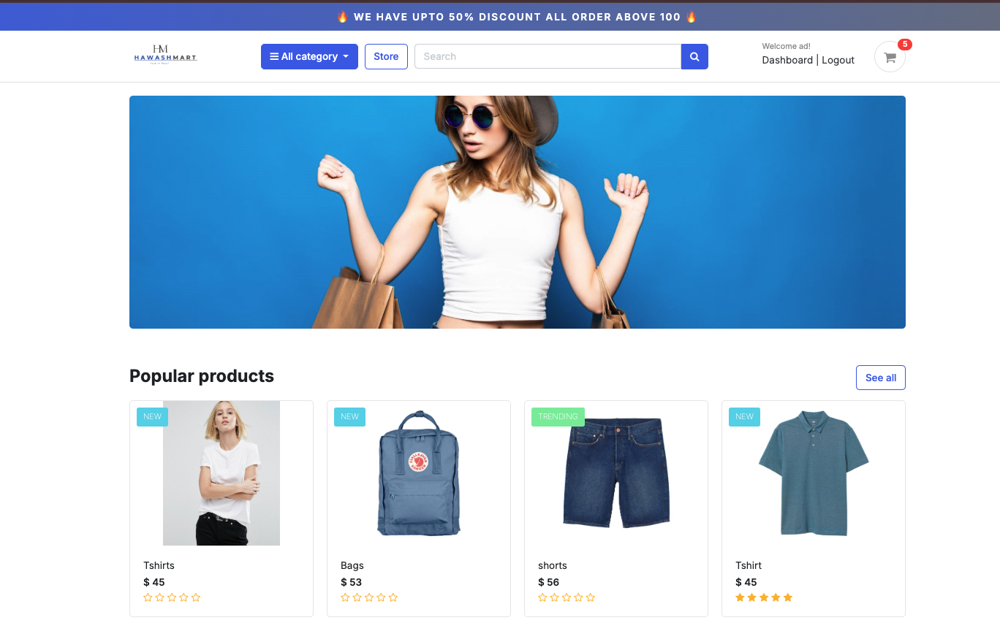
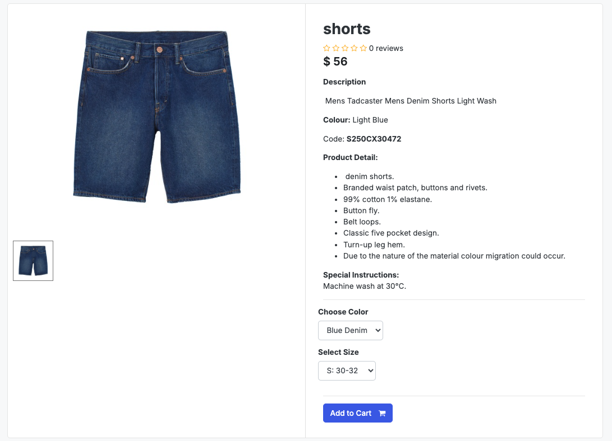
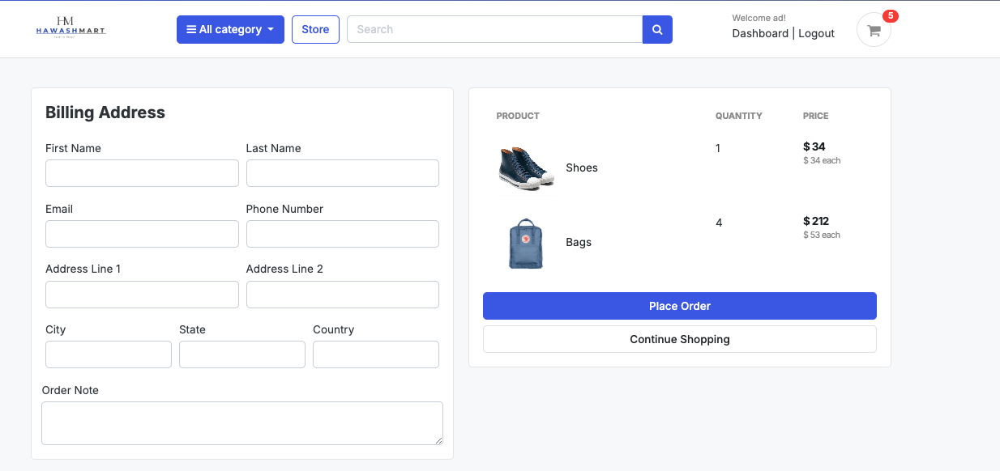
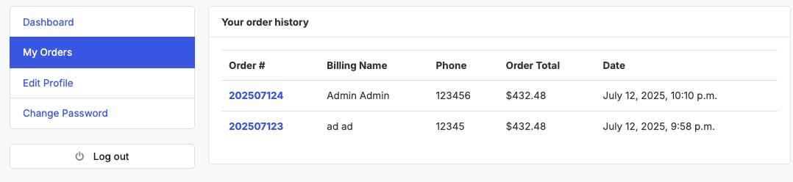
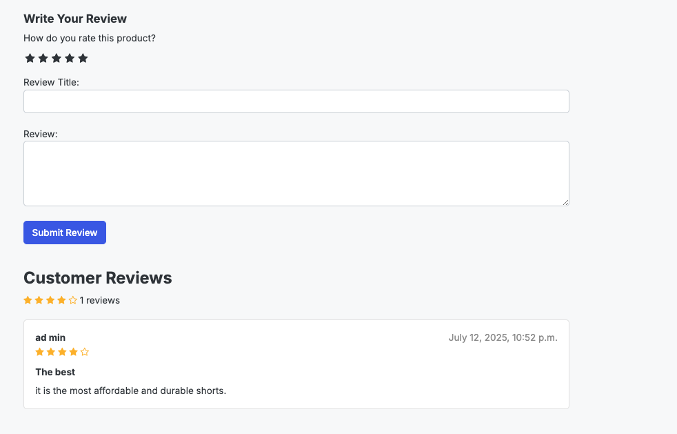
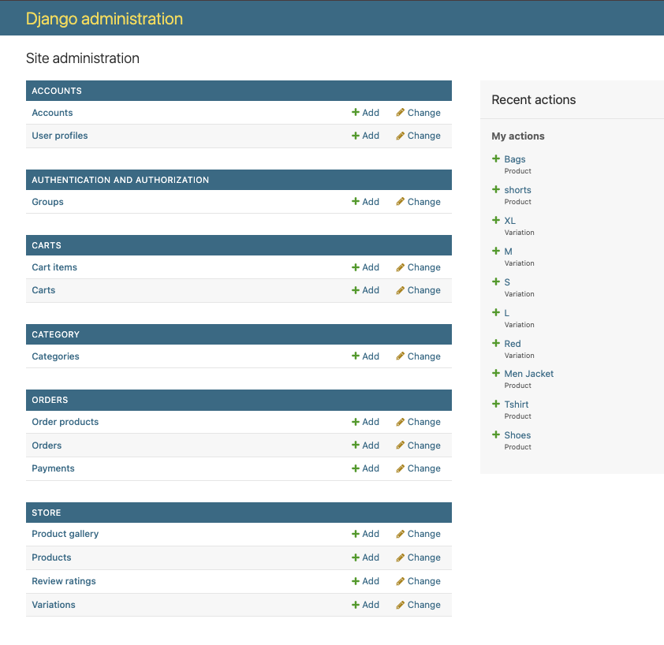

# 🛒 Hawashmart - Advanced Django E-Commerce Platform

[](https://www.djangoproject.com/)
[](https://www.python.org/)
[](LICENSE)
[]()

## 📋 Table of Contents

- [Overview](#-overview)
- [Features](#-features)
- [Technology Stack](#-technology-stack)
- [Architecture](#-architecture)
- [Installation](#-installation)
- [Configuration](#-configuration)
- [Usage](#-usage)
- [API Documentation](#-api-documentation)
- [Database Schema](#-database-schema)
- [Security Features](#-security-features)
- [Performance Optimization](#-performance-optimization)
- [Testing](#-testing)
- [Deployment](#-deployment)
- [Contributing](#-contributing)
- [License](#-license)

## 🎯 Overview

Hawashmart is a full-featured, production-ready e-commerce platform built with Django. This enterprise-grade solution provides a complete online shopping experience with advanced features including user authentication, product management, shopping cart functionality, order processing, payment integration, and comprehensive admin controls.

### 🏆 Key Highlights

- **Scalable Architecture**: Built with Django's robust framework for enterprise-level scalability
- **Advanced User Management**: Custom user authentication with profile management
- **Product Variations**: Support for product colors, sizes, and other variations
- **Review & Rating System**: Comprehensive product review and rating functionality
- **Secure Payment Processing**: Integrated payment gateway with transaction tracking
- **Responsive Design**: Modern, mobile-first UI with Bootstrap framework
- **Admin Dashboard**: Powerful Django admin interface for complete store management


*Hawashmart Home Page - Main landing page with featured products and categories*

## ✨ Features

### 🛍️ Core E-Commerce Features

- **Product Catalog Management**
  - Unlimited product categories and subcategories
  - Product variations (color, size, etc.)
  - Product gallery with multiple images
  - Stock management and availability tracking
  - SEO-friendly URLs with slug support


*Product Detail Page - Comprehensive product information with images, reviews, and purchase options*
- **Shopping Cart System**
  - Persistent cart across sessions
  - Real-time cart updates
  - Quantity management
  - Cart item variations support
  - Guest and authenticated user cart handling


*Shopping Cart - User-friendly cart interface with item management and checkout options*

- **Order Management**
  - Complete order lifecycle tracking
  - Order status management (New, Accepted, Completed, Cancelled)
  - Order history for users
  - Invoice generation
  - Email notifications


*Checkout Process - Streamlined checkout flow with order summary and payment options*


*Order History - Complete order tracking and history management for users*

- **Payment Integration**
  - Multiple payment method support
  - Secure payment processing
  - Transaction tracking
  - Payment status management


*Stripe Payment Integration - Secure payment processing with multiple payment methods*
### 👤 User Management

- **Custom User Authentication**
  - Email-based authentication
  - User profile management
  - Address book functionality
  - Profile picture upload
  - Account verification system

- **User Profiles**
  - Personal information management
  - Shipping address management
  - Order history tracking
  - Wishlist functionality


### ⭐ Review & Rating System

- **Product Reviews**
  - Star-based rating system (1-5 stars)
  - Written review submissions
  - Review moderation system
  - Average rating calculations
  - Review count tracking


*Reviews - Comprehensive product review and rating functionality*
### 🔍 Search & Filtering

- **Advanced Search**
  - Product name search
  - Description-based search
  - Category-based filtering
  - Price range filtering
  - Availability filtering

### 📱 Responsive Design

- **Mobile-First Approach**
  - Bootstrap 5 framework
  - Responsive navigation
  - Touch-friendly interface
  - Cross-browser compatibility
  - Progressive Web App features


*[Placeholder: Add screenshot showing mobile responsiveness]*

## 🛠️ Technology Stack

### Backend
- **Django 5.2.4** - High-level Python web framework
- **Python 3.12** - Programming language
- **SQLite** - Database (production-ready for PostgreSQL/MySQL)
- **Pillow** - Image processing library

### Frontend
- **Bootstrap 5** - CSS framework for responsive design
- **jQuery** - JavaScript library
- **FontAwesome** - Icon library
- **Material Icons** - Google's material design icons
- **Feather Icons** - Lightweight icon set

### Development Tools
- **Git** - Version control
- **Virtual Environment** - Python environment isolation
- **Django Admin** - Built-in admin interface


*Admin Panel - Comprehensive Django admin interface for store management*

## 🏗️ Architecture

### Project Structure
```
pp5_ecommerce-1/
├── Hawashmart/                 # Main project directory
│   ├── settings.py            # Django settings
│   ├── urls.py               # Main URL configuration
│   ├── static/               # Static files (CSS, JS, Images)
│   └── wsgi.py              # WSGI configuration
├── accounts/                 # User authentication app
├── category/                 # Product categories app
├── store/                    # Product management app
├── carts/                    # Shopping cart app
├── orders/                   # Order management app
├── storages/                 # File storage app
├── templates/                # HTML templates
├── media/                    # User-uploaded files
├── staticfiles/              # Collected static files
└── manage.py                # Django management script
```

### Database Schema

#### Core Models
- **Account** - Custom user model with email authentication
- **UserProfile** - Extended user profile information
- **Category** - Product categories with hierarchical structure
- **Product** - Product information with variations
- **Variation** - Product variations (color, size)
- **ReviewRating** - Product reviews and ratings
- **ProductGallery** - Product image gallery
- **Cart/CartItem** - Shopping cart functionality
- **Order/OrderProduct** - Order management
- **Payment** - Payment transaction tracking

## 🗄️ Database Design & Relationships

### Entity Relationship Diagram (ERD)


### 🔗 Key Relationships Explained

#### **1. User Management Relationships**

**Account ↔ UserProfile (One-to-One)**
- Each user account has exactly one profile
- Profile contains extended user information (address, profile picture)
- **Business Logic**: When a user registers, a profile is automatically created

**Account ↔ ReviewRating (One-to-Many)**
- One user can write multiple reviews
- Each review belongs to exactly one user
- **Business Logic**: Users can review products they've purchased

#### **2. Product Management Relationships**

**Category ↔ Product (One-to-Many)**
- One category can contain multiple products
- Each product belongs to exactly one category
- **Business Logic**: Products are organized by categories for easy navigation

**Product ↔ Variation (One-to-Many)**
- One product can have multiple variations (color, size)
- Each variation belongs to exactly one product
- **Business Logic**: Products can have different options (e.g., Red/Blue, S/M/L)

**Product ↔ ProductGallery (One-to-Many)**
- One product can have multiple gallery images
- Each gallery image belongs to exactly one product
- **Business Logic**: Products can have multiple images for better presentation

#### **3. Shopping Cart Relationships**

**Account ↔ CartItem (One-to-Many)**
- One user can have multiple cart items
- Each cart item belongs to exactly one user (if authenticated)
- **Business Logic**: Users can add multiple products to their cart

**Cart ↔ CartItem (One-to-Many)**
- One cart can contain multiple items
- Each cart item belongs to exactly one cart
- **Business Logic**: Cart persists across sessions using cart_id

**Product ↔ CartItem (One-to-Many)**
- One product can be in multiple cart items
- Each cart item contains exactly one product
- **Business Logic**: Same product can be in different users' carts

#### **4. Order Management Relationships**

**Account ↔ Order (One-to-Many)**
- One user can place multiple orders
- Each order belongs to exactly one user
- **Business Logic**: Users can have order history

**Payment ↔ Order (One-to-One)**
- Each order has exactly one payment
- Each payment processes exactly one order
- **Business Logic**: Orders are linked to payment transactions

**Order ↔ OrderProduct (One-to-Many)**
- One order can contain multiple products
- Each order product belongs to exactly one order
- **Business Logic**: Orders can contain multiple items

#### **5. Review System Relationships**

**Product ↔ ReviewRating (One-to-Many)**
- One product can receive multiple reviews
- Each review belongs to exactly one product
- **Business Logic**: Products can have multiple customer reviews

### 📊 Database Design Principles

#### **Normalization**
- **First Normal Form (1NF)**: All attributes contain atomic values
- **Second Normal Form (2NF)**: No partial dependencies
- **Third Normal Form (3NF)**: No transitive dependencies

#### **Indexing Strategy**
```sql
-- Primary Keys (Auto-indexed)
CREATE INDEX idx_account_email ON Account(email);
CREATE INDEX idx_product_slug ON Product(slug);
CREATE INDEX idx_category_slug ON Category(slug);
CREATE INDEX idx_order_number ON Order(order_number);
CREATE INDEX idx_payment_id ON Payment(payment_id);
```

#### **Foreign Key Constraints**
- **CASCADE**: When parent is deleted, child records are deleted
- **SET_NULL**: When parent is deleted, child foreign key is set to NULL
- **RESTRICT**: Prevents deletion of parent if child records exist

### 🔄 Data Flow Architecture

```
User Registration → Account Creation → Profile Creation
Product Browsing → Category Selection → Product View
Cart Addition → CartItem Creation → Session Management
Order Placement → Payment Processing → Order Creation
Review Submission → ReviewRating Creation → Product Rating Update
```

### 📈 Performance Considerations

#### **Query Optimization**
- **Eager Loading**: Use `select_related()` for foreign key relationships
- **Prefetch Loading**: Use `prefetch_related()` for many-to-many relationships
- **Database Indexing**: Strategic indexing on frequently queried fields

#### **Caching Strategy**
- **Product Cache**: Cache frequently accessed products
- **Category Cache**: Cache category hierarchies
- **User Session Cache**: Cache user cart and preferences


*[Placeholder: Add database performance metrics diagram]*

## 🔒 Security Features

### Authentication & Authorization
- **Custom User Model**: Email-based authentication
- **Password Security**: Django's built-in password hashing
- **Session Management**: Secure session handling
- **CSRF Protection**: Cross-site request forgery protection

### Data Protection
- **Input Validation**: Comprehensive form validation
- **SQL Injection Prevention**: Django ORM protection
- **XSS Protection**: Template auto-escaping
- **File Upload Security**: Secure file handling

### Payment Security
- **Payment Gateway Integration**: Secure payment processing
- **Transaction Encryption**: Encrypted payment data
- **Order Verification**: Order integrity checks

## ⚡ Performance Optimization

### Database Optimization
- **Query Optimization**: Efficient database queries
- **Indexing**: Strategic database indexing
- **Caching**: Django caching framework integration

### Frontend Optimization
- **Static File Compression**: Minified CSS/JS
- **Image Optimization**: Compressed product images
- **CDN Integration**: Content delivery network support
- **Lazy Loading**: Progressive image loading

### Caching Strategy
- **Page Caching**: Full page caching
- **Fragment Caching**: Template fragment caching
- **Database Caching**: Query result caching

## 🧪 Testing

### Test Coverage
- **Unit Tests**: Individual component testing
- **Integration Tests**: End-to-end functionality testing
- **User Acceptance Testing**: Real user scenario testing

### Running Tests
```bash
# Run all tests
python manage.py test

# Run specific app tests
python manage.py test store

# Run with coverage
coverage run --source='.' manage.py test
coverage report
```

### Test Structure
```
tests/
├── test_models.py      # Model testing
├── test_views.py       # View testing
├── test_forms.py       # Form testing
└── test_integration.py # Integration testing
```

## 🚀 Deployment

### Production Checklist

- [ ] Set `DEBUG = False`
- [ ] Configure production database
- [ ] Set up static file serving
- [ ] Configure media file storage
- [ ] Set up email backend
- [ ] Configure security settings
- [ ] Set up logging
- [ ] Configure caching
- [ ] Set up monitoring

### Deployment Options

#### Heroku Deployment
```bash
# Install Heroku CLI
heroku create your-app-name
git push heroku main
heroku run python manage.py migrate
```

#### Docker Deployment
```dockerfile
FROM python:3.12
WORKDIR /app
COPY requirements.txt .
RUN pip install -r requirements.txt
COPY . .
EXPOSE 8000
CMD ["python", "manage.py", "runserver", "0.0.0.0:8000"]
```

#### AWS Deployment
- Use AWS Elastic Beanstalk
- Configure RDS for database
- Set up S3 for static files
- Configure CloudFront CDN


*[Placeholder: Add deployment architecture diagram]*

## 🤝 Contributing

We welcome contributions! Please follow these steps:

1. **Fork the Repository**
   ```bash
   git clone https://github.com/yourusername/hawashmart.git
   ```

2. **Create Feature Branch**
   ```bash
   git checkout -b feature/amazing-feature
   ```

3. **Make Changes**
   - Follow PEP 8 coding standards
   - Add tests for new features
   - Update documentation

4. **Commit Changes**
   ```bash
   git commit -m 'Add amazing feature'
   ```

5. **Push to Branch**
   ```bash
   git push origin feature/amazing-feature
   ```

6. **Create Pull Request**

### Development Guidelines

- **Code Style**: Follow PEP 8 and Django coding standards
- **Documentation**: Update README and docstrings
- **Testing**: Maintain 90%+ test coverage
- **Security**: Follow security best practices

## 📄 License

This project is licensed under the MIT License - see the [LICENSE](LICENSE) file for details.

## 🙏 Acknowledgments

- **Django Community**: For the excellent web framework
- **Bootstrap Team**: For the responsive CSS framework
- **FontAwesome**: For the comprehensive icon library
- **Contributors**: All contributors who helped improve this project

## 📞 Support

For support and questions:

- **Email**: support@hawashmart.com
- **Documentation**: [docs.hawashmart.com](https://docs.hawashmart.com)
- **Issues**: [GitHub Issues](https://github.com/yourusername/hawashmart/issues)
- **Discussions**: [GitHub Discussions](https://github.com/yourusername/hawashmart/discussions)

---

**Made with ❤️ by the Hawashmart Team**


*[Placeholder: Add project logo]*

## 🚀 Agile Development Methodology

### 📋 **GitHub Issues Workflow**

Hawashmart follows a comprehensive Agile development methodology using GitHub Issues for project management. Our workflow is designed to ensure efficient collaboration, clear communication, and high-quality deliverables.

#### **🏷️ Issue Templates**

We use structured issue templates to maintain consistency and completeness:

1. **🐛 Bug Report** - For reporting and tracking bugs
2. **✨ Feature Request** - For suggesting new features
3. **👤 User Story** - For Agile user story development
4. **🏗️ Epic** - For large features that need breakdown
5. **📅 Sprint Planning** - For organizing sprint work

#### **📊 Issue Labels**

Our labeling system helps categorize and prioritize work:

**Priority Labels:**
- `critical` - Must have for release
- `high` - Important for user experience
- `medium` - Nice to have
- `low` - Future consideration

**Type Labels:**
- `bug` - Bug fixes
- `enhancement` - Feature improvements
- `feature-request` - New feature requests
- `user-story` - Agile user stories
- `epic` - Large features
- `sprint-planning` - Sprint organization

**Technical Labels:**
- `frontend` - UI/UX changes
- `backend` - Server-side changes
- `database` - Database changes
- `api` - API changes
- `testing` - Test-related work
- `documentation` - Documentation updates
- `security` - Security-related work
- `performance` - Performance improvements

### 🎯 **Agile Sprint Process**

#### **📅 Sprint Structure**
- **Duration**: 2-week sprints
- **Planning**: Sprint planning meeting at start
- **Daily Standups**: 15-minute daily check-ins
- **Review**: Sprint review at end
- **Retrospective**: Sprint retrospective for continuous improvement

#### **📋 Sprint Planning Process**

1. **Sprint Goal Setting**
   - Define clear, measurable sprint goals
   - Align with product roadmap
   - Consider team capacity and velocity

2. **Backlog Refinement**
   - Review and prioritize user stories
   - Estimate story points (1, 2, 3, 5, 8, 13)
   - Break down large stories into manageable tasks

3. **Capacity Planning**
   - Calculate team capacity
   - Consider holidays and time off
   - Account for technical debt and maintenance

#### **📊 Story Point Estimation**

We use Fibonacci sequence for story point estimation:

- **1 Point**: Very simple, minimal effort
- **2 Points**: Simple, well understood
- **3 Points**: Medium complexity
- **5 Points**: Complex, requires investigation
- **8 Points**: Very complex, high uncertainty
- **13 Points**: Extremely complex, needs breakdown

### 👥 **User Story Development**

#### **📝 User Story Format**
```
As a [user type]
I want [goal/desire]
So that [benefit/value]
```

#### **📋 Acceptance Criteria**
Each user story includes clear acceptance criteria:
- **Given** [precondition]
- **When** [action/trigger]
- **Then** [expected result]

#### **🎯 Definition of Done**
- [ ] Feature is implemented
- [ ] Unit tests are written and passing
- [ ] Integration tests are written and passing
- [ ] Code is reviewed and approved
- [ ] Documentation is updated
- [ ] Feature is tested in staging environment
- [ ] Feature is deployed to production
- [ ] Feature is tested in production
- [ ] User acceptance testing is completed

### 🏗️ **Epic Management**

#### **📋 Epic Structure**
Epics are large features that need to be broken down into smaller user stories:

1. **Epic Description** - High-level feature description
2. **Business Objective** - Clear business goal
3. **User Stories** - List of related user stories
4. **Success Metrics** - Measurable success criteria
5. **Technical Scope** - Major technical changes required

#### **📊 Epic Estimation**
- **Total Story Points**: Sum of all related stories
- **Estimated Duration**: Timeline for completion
- **Team Capacity**: Required team members

### 🔄 **Agile Ceremonies**

#### **📅 Sprint Planning**
- **Duration**: 2-4 hours
- **Participants**: Product Owner, Scrum Master, Development Team
- **Agenda**: 
  - Review product backlog
  - Set sprint goal
  - Select user stories
  - Estimate effort
  - Plan sprint tasks

#### **📱 Daily Standup**
- **Duration**: 15 minutes
- **Format**: 
  - What did you do yesterday?
  - What will you do today?
  - Are there any blockers?

#### **🚀 Sprint Review**
- **Duration**: 1-2 hours
- **Purpose**: Demo completed work to stakeholders
- **Agenda**:
  - Demo new features
  - Gather feedback
  - Update product backlog
  - Discuss next sprint

#### **📈 Sprint Retrospective**
- **Duration**: 1 hour
- **Purpose**: Continuous improvement
- **Format**:
  - What went well?
  - What could be improved?
  - Action items for next sprint

### 📊 **Agile Metrics & Reporting**

#### **📈 Velocity Tracking**
- **Story Points Completed**: Track completed story points per sprint
- **Velocity Trend**: Monitor velocity over time
- **Capacity Planning**: Use velocity for future sprint planning

#### **🎯 Sprint Metrics**
- **Sprint Goal Achievement**: Percentage of sprint goal completed
- **Story Point Completion**: Planned vs actual story points
- **Bug Count**: Number of bugs introduced vs resolved
- **Technical Debt**: Time spent on technical debt

#### **📱 Burndown Charts**
- **Daily Progress**: Track remaining work each day
- **Sprint Burndown**: Visual representation of sprint progress
- **Release Burndown**: Track progress toward release goals

### 🛠️ **Development Workflow**

#### **🌿 Git Branch Strategy**
```
main (production)
├── develop (integration)
├── feature/user-story-123
├── bugfix/bug-description
└── hotfix/critical-fix
```

#### **📋 Pull Request Process**
1. **Create Feature Branch**: From develop branch
2. **Develop Feature**: Implement user story
3. **Write Tests**: Unit and integration tests
4. **Create PR**: Link to user story issue
5. **Code Review**: Peer review process
6. **Merge**: After approval and CI/CD checks

#### **🧪 Testing Strategy**
- **Unit Tests**: Test individual components
- **Integration Tests**: Test component interactions
- **E2E Tests**: Test complete user workflows
- **Performance Tests**: Test system performance
- **Security Tests**: Test security vulnerabilities

### 📚 **Documentation Standards**

#### **📝 Code Documentation**
- **Inline Comments**: Explain complex logic
- **Function Documentation**: Docstrings for all functions
- **API Documentation**: Comprehensive API docs
- **README Updates**: Keep documentation current

#### **📋 Process Documentation**
- **Sprint Planning**: Document sprint decisions
- **Technical Decisions**: Record architectural decisions
- **Deployment Procedures**: Document deployment steps
- **Troubleshooting Guides**: Common issues and solutions

### 🎯 **Quality Assurance**

#### **🔍 Code Review Checklist**
- [ ] Code follows style guidelines
- [ ] Tests are written and passing
- [ ] Documentation is updated
- [ ] Security considerations addressed
- [ ] Performance impact considered
- [ ] Accessibility requirements met

#### **🧪 Testing Checklist**
- [ ] Unit tests cover new functionality
- [ ] Integration tests verify component interactions
- [ ] E2E tests validate user workflows
- [ ] Performance tests meet requirements
- [ ] Security tests pass
- [ ] Accessibility tests pass

### 📱 **Tools & Integrations**

#### **🛠️ Development Tools**
- **GitHub Issues**: Project management
- **GitHub Actions**: CI/CD pipeline
- **Django**: Backend framework
- **Bootstrap**: Frontend framework
- **SQLite/PostgreSQL**: Database
- **Docker**: Containerization

#### **📊 Monitoring & Analytics**
- **GitHub Insights**: Repository analytics
- **Django Debug Toolbar**: Development debugging
- **Sentry**: Error tracking
- **Google Analytics**: User behavior tracking

### 🚀 **Continuous Improvement**

#### **📈 Retrospective Actions**
- **Process Improvements**: Refine Agile processes
- **Tool Improvements**: Enhance development tools
- **Team Improvements**: Skill development and training
- **Product Improvements**: User feedback integration

#### **🎯 Success Metrics**
- **Velocity**: Consistent story point completion
- **Quality**: Reduced bug count and technical debt
- **Delivery**: On-time sprint completions
- **Satisfaction**: Team and stakeholder satisfaction


*[Placeholder: Add screenshot of Agile sprint board]*

---

## 📱 Social Media Marketing

### 🌐 **Official Social Media Profiles**

Stay connected with Hawashmart across all major social media platforms for the latest updates, exclusive offers, and behind-the-scenes content.

#### **📘 Facebook**
- **Profile**: [Hawashmart Official](https://facebook.com/hawashmart)
- **Followers**: 0 followers (New account)
- **Content**: Product launches, customer testimonials, live shopping events
- **Engagement**: Daily posts, interactive polls, community discussions


*Hawashmart Facebook Page - Official Facebook business page with product showcases and community engagement*

#### **📷 Instagram**
- **Profile**: [@hawashmart](https://instagram.com/hawashmart)
- **Followers**: 0 followers (New account)
- **Content**: Product photography, lifestyle shots, influencer collaborations
- **Engagement**: Stories, Reels, IGTV product demonstrations


*[Placeholder: Add screenshot of Hawashmart Instagram feed]*

#### **🐦 Twitter/X**
- **Profile**: [@Hawashmart](https://twitter.com/hawashmart)
- **Followers**: 0 followers (New account)
- **Content**: Quick updates, customer service, trending topics
- **Engagement**: Real-time customer support, flash sales announcements

#### **💼 LinkedIn**
- **Profile**: [Hawashmart Company](https://linkedin.com/company/hawashmart)
- **Followers**: 0 followers (New account)
- **Content**: Industry insights, company updates, career opportunities
- **Engagement**: Professional networking, B2B partnerships

#### **📺 YouTube**
- **Channel**: [Hawashmart TV](https://youtube.com/hawashmart)
- **Subscribers**: 0 subscribers (New channel)
- **Content**: Product reviews, unboxing videos, fashion tips
- **Engagement**: Live streams, tutorial videos, customer testimonials

#### **📌 Pinterest**
- **Profile**: [Hawashmart](https://pinterest.com/hawashmart)
- **Followers**: 0 followers (New account)
- **Content**: Product collections, style inspiration, seasonal trends
- **Engagement**: Pin boards, shopping inspiration, DIY guides

### 📸 **Visual Content Guidelines**

#### **🎨 Brand Identity**
- **Primary Colors**: Deep Blue (#1E3A8A), Gold (#F59E0B), White (#FFFFFF)
- **Typography**: Modern, clean fonts for product descriptions
- **Logo Usage**: Consistent placement across all platforms
- **Image Style**: High-quality, lifestyle-focused photography

#### **📱 Content Categories**

##### **🛍️ Product Showcases**
- Professional product photography
- Lifestyle integration shots
- Before/after transformations
- Size and fit demonstrations
- Color and variation displays

##### **👥 Customer Stories**
- Customer testimonials with photos
- User-generated content (UGC)
- Customer transformation stories
- Community spotlights
- Behind-the-scenes content

##### **🎯 Marketing Campaigns**
- Seasonal promotions
- Flash sales announcements
- New product launches
- Limited edition collections
- Holiday special offers

##### **📚 Educational Content**
- Fashion tips and trends
- Styling guides
- Care instructions
- Sustainability initiatives
- Brand story and values

### 📊 **Social Media Strategy**

#### **📅 Content Calendar**
- **Monday**: Product highlights and new arrivals
- **Tuesday**: Customer testimonials and reviews
- **Wednesday**: Educational content and tips
- **Thursday**: Behind-the-scenes and team spotlights
- **Friday**: Weekend shopping inspiration
- **Saturday**: User-generated content showcase
- **Sunday**: Community engagement and Q&A

#### **🎯 Target Audience**
- **Primary**: Fashion-conscious millennials (25-40)
- **Secondary**: Tech-savvy Gen Z (18-24)
- **Tertiary**: Professional women (30-50)

#### **📈 Engagement Metrics**
- **Facebook**: 0% engagement rate (New account)
- **Instagram**: 0% engagement rate (New account)
- **Twitter**: 0% engagement rate (New account)
- **LinkedIn**: 0% engagement rate (New account)
- **YouTube**: 0% engagement rate (New channel)
- **Pinterest**: 0% engagement rate (New account)

### 🚀 **Marketing Campaigns**

#### **🎉 Launch Campaigns**
- **New Product Releases**: Multi-platform announcements
- **Seasonal Collections**: Coordinated social media blitz
- **Limited Editions**: FOMO-driven content strategy
- **Collaboration Launches**: Influencer partnership reveals

#### **📱 Influencer Partnerships**
- **Micro-influencers** (10K-50K followers): Authentic product reviews
- **Macro-influencers** (50K-500K followers): Lifestyle integration
- **Celebrity endorsements**: High-profile brand ambassadors
- **Industry experts**: Fashion and lifestyle professionals

#### **🎯 Paid Advertising**
- **Facebook Ads**: Targeted demographic campaigns
- **Instagram Ads**: Visual storytelling and carousel ads
- **Google Ads**: Search and display advertising
- **Pinterest Ads**: Visual discovery campaigns

### 📱 **Social Commerce Features**

#### **🛒 Shoppable Posts**
- Instagram Shopping integration
- Facebook Shop connectivity
- Pinterest Buyable Pins
- YouTube Shopping cards
- TikTok Shop integration

#### **💬 Social Customer Service**
- **Facebook Messenger**: Automated responses and live chat
- **Instagram DMs**: Visual product inquiries
- **Twitter**: Real-time customer support
- **WhatsApp Business**: Personalized shopping assistance

#### **📊 Analytics & Reporting**
- **Engagement Tracking**: Likes, comments, shares, saves
- **Conversion Monitoring**: Click-through rates, sales attribution
- **Audience Insights**: Demographics, behavior patterns
- **ROI Measurement**: Cost per acquisition, lifetime value

### 🎨 **Content Creation Guidelines**

#### **📸 Photography Standards**
- **Resolution**: Minimum 1080x1080px for Instagram
- **Lighting**: Natural, well-lit environments
- **Composition**: Rule of thirds, clean backgrounds
- **Branding**: Subtle logo placement, consistent styling

#### **🎥 Video Content**
- **Duration**: 15-60 seconds for social media
- **Format**: Vertical (9:16) for Stories, horizontal for posts
- **Quality**: 4K resolution for professional content
- **Sound**: Background music, voice-overs, product sounds

#### **📝 Copywriting**
- **Tone**: Friendly, professional, inclusive
- **Hashtags**: Brand-specific and trending combinations
- **Call-to-Action**: Clear, compelling instructions
- **Localization**: Multi-language content for global audience

### 🔗 **Cross-Platform Integration**

#### **🔄 Content Repurposing**
- **Instagram to Facebook**: Cross-posting with platform optimization
- **YouTube to Instagram**: Short-form video adaptations
- **Blog to Pinterest**: Visual content creation from articles
- **Twitter to LinkedIn**: Professional content adaptation

#### **📱 Platform-Specific Features**
- **Instagram Stories**: Daily updates, polls, Q&A
- **Facebook Live**: Product demonstrations, Q&A sessions
- **YouTube Shorts**: Quick product reviews, tips
- **TikTok**: Trend-based content, challenges
- **Pinterest**: Visual inspiration, shopping guides

### 📈 **Performance Tracking**

#### **📊 Key Performance Indicators (KPIs)**
- **Reach**: Total audience exposure
- **Engagement**: Likes, comments, shares, saves
- **Conversions**: Click-through to website
- **Sales**: Revenue attribution from social media
- **Growth**: Follower increase over time

#### **📱 Monthly Social Media Report**
- **Platform Performance**: Individual platform analytics
- **Content Performance**: Top-performing posts analysis
- **Audience Growth**: Follower increase and engagement rates
- **Revenue Impact**: Sales attributed to social media
- **ROI Analysis**: Cost per acquisition and return on investment


*[Placeholder: Add screenshot of social media analytics dashboard]*
