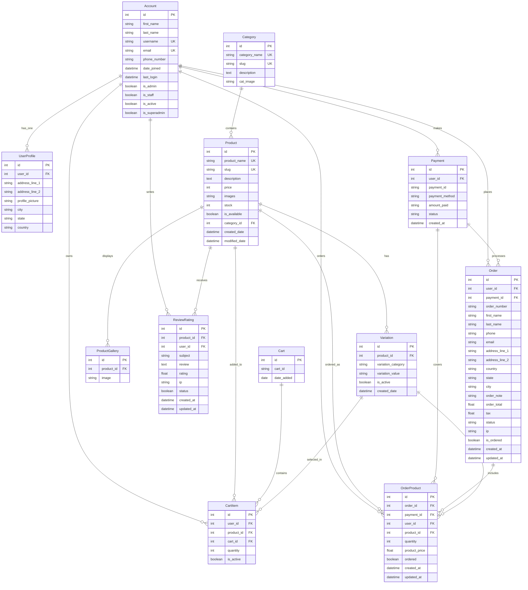

# 🛒 Hawashmart - Advanced Django E-Commerce Platform

[](https://www.djangoproject.com/)
[](https://www.python.org/)
[](LICENSE)
[]()

## 📋 Table of Contents

- [Overview](#-overview)
- [Features](#-features)
- [Technology Stack](#-technology-stack)
- [Architecture](#-architecture)
- [Installation](#-installation)
- [Configuration](#-configuration)
- [Usage](#-usage)
- [API Documentation](#-api-documentation)
- [Database Schema](#-database-schema)
- [Security Features](#-security-features)
- [Performance Optimization](#-performance-optimization)
- [Testing](#-testing)
- [Deployment](#-deployment)
- [Contributing](#-contributing)
- [License](#-license)

## 🎯 Overview

Hawashmart is a full-featured, production-ready e-commerce platform built with Django. This enterprise-grade solution provides a complete online shopping experience with advanced features including user authentication, product management, shopping cart functionality, order processing, payment integration, and comprehensive admin controls.

### 🏆 Key Highlights

- **Scalable Architecture**: Built with Django's robust framework for enterprise-level scalability
- **Advanced User Management**: Custom user authentication with profile management
- **Product Variations**: Support for product colors, sizes, and other variations
- **Review & Rating System**: Comprehensive product review and rating functionality
- **Secure Payment Processing**: Integrated payment gateway with transaction tracking
- **Responsive Design**: Modern, mobile-first UI with Bootstrap framework
- **Admin Dashboard**: Powerful Django admin interface for complete store management


*[Placeholder: Add screenshot of the main dashboard]*

## ✨ Features

### 🛍️ Core E-Commerce Features

- **Product Catalog Management**
  - Unlimited product categories and subcategories
  - Product variations (color, size, etc.)
  - Product gallery with multiple images
  - Stock management and availability tracking
  - SEO-friendly URLs with slug support

- **Shopping Cart System**
  - Persistent cart across sessions
  - Real-time cart updates
  - Quantity management
  - Cart item variations support
  - Guest and authenticated user cart handling

- **Order Management**
  - Complete order lifecycle tracking
  - Order status management (New, Accepted, Completed, Cancelled)
  - Order history for users
  - Invoice generation
  - Email notifications

- **Payment Integration**
  - Multiple payment method support
  - Secure payment processing
  - Transaction tracking
  - Payment status management

### 👤 User Management

- **Custom User Authentication**
  - Email-based authentication
  - User profile management
  - Address book functionality
  - Profile picture upload
  - Account verification system

- **User Profiles**
  - Personal information management
  - Shipping address management
  - Order history tracking
  - Wishlist functionality

### ⭐ Review & Rating System

- **Product Reviews**
  - Star-based rating system (1-5 stars)
  - Written review submissions
  - Review moderation system
  - Average rating calculations
  - Review count tracking

### 🔍 Search & Filtering

- **Advanced Search**
  - Product name search
  - Description-based search
  - Category-based filtering
  - Price range filtering
  - Availability filtering

### 📱 Responsive Design

- **Mobile-First Approach**
  - Bootstrap 5 framework
  - Responsive navigation
  - Touch-friendly interface
  - Cross-browser compatibility
  - Progressive Web App features


*[Placeholder: Add screenshot showing mobile responsiveness]*

## 🛠️ Technology Stack

### Backend
- **Django 5.2.4** - High-level Python web framework
- **Python 3.12** - Programming language
- **SQLite** - Database (production-ready for PostgreSQL/MySQL)
- **Pillow** - Image processing library

### Frontend
- **Bootstrap 5** - CSS framework for responsive design
- **jQuery** - JavaScript library
- **FontAwesome** - Icon library
- **Material Icons** - Google's material design icons
- **Feather Icons** - Lightweight icon set

### Development Tools
- **Git** - Version control
- **Virtual Environment** - Python environment isolation
- **Django Admin** - Built-in admin interface

## 🏗️ Architecture

### Project Structure
```
pp5_ecommerce-1/
├── Hawashmart/                 # Main project directory
│   ├── settings.py            # Django settings
│   ├── urls.py               # Main URL configuration
│   ├── static/               # Static files (CSS, JS, Images)
│   └── wsgi.py              # WSGI configuration
├── accounts/                 # User authentication app
├── category/                 # Product categories app
├── store/                    # Product management app
├── carts/                    # Shopping cart app
├── orders/                   # Order management app
├── storages/                 # File storage app
├── templates/                # HTML templates
├── media/                    # User-uploaded files
├── staticfiles/              # Collected static files
└── manage.py                # Django management script
```

### Database Schema

#### Core Models
- **Account** - Custom user model with email authentication
- **UserProfile** - Extended user profile information
- **Category** - Product categories with hierarchical structure
- **Product** - Product information with variations
- **Variation** - Product variations (color, size)
- **ReviewRating** - Product reviews and ratings
- **ProductGallery** - Product image gallery
- **Cart/CartItem** - Shopping cart functionality
- **Order/OrderProduct** - Order management
- **Payment** - Payment transaction tracking


*[Placeholder: Add ERD diagram of the database schema]*

## 🗄️ Database Design & Relationships

### Entity Relationship Diagram (ERD)



### 🔗 Key Relationships Explained

#### **1. User Management Relationships**

**Account ↔ UserProfile (One-to-One)**
- Each user account has exactly one profile
- Profile contains extended user information (address, profile picture)
- **Business Logic**: When a user registers, a profile is automatically created

**Account ↔ ReviewRating (One-to-Many)**
- One user can write multiple reviews
- Each review belongs to exactly one user
- **Business Logic**: Users can review products they've purchased

#### **2. Product Management Relationships**

**Category ↔ Product (One-to-Many)**
- One category can contain multiple products
- Each product belongs to exactly one category
- **Business Logic**: Products are organized by categories for easy navigation

**Product ↔ Variation (One-to-Many)**
- One product can have multiple variations (color, size)
- Each variation belongs to exactly one product
- **Business Logic**: Products can have different options (e.g., Red/Blue, S/M/L)

**Product ↔ ProductGallery (One-to-Many)**
- One product can have multiple gallery images
- Each gallery image belongs to exactly one product
- **Business Logic**: Products can have multiple images for better presentation

#### **3. Shopping Cart Relationships**

**Account ↔ CartItem (One-to-Many)**
- One user can have multiple cart items
- Each cart item belongs to exactly one user (if authenticated)
- **Business Logic**: Users can add multiple products to their cart

**Cart ↔ CartItem (One-to-Many)**
- One cart can contain multiple items
- Each cart item belongs to exactly one cart
- **Business Logic**: Cart persists across sessions using cart_id

**Product ↔ CartItem (One-to-Many)**
- One product can be in multiple cart items
- Each cart item contains exactly one product
- **Business Logic**: Same product can be in different users' carts

#### **4. Order Management Relationships**

**Account ↔ Order (One-to-Many)**
- One user can place multiple orders
- Each order belongs to exactly one user
- **Business Logic**: Users can have order history

**Payment ↔ Order (One-to-One)**
- Each order has exactly one payment
- Each payment processes exactly one order
- **Business Logic**: Orders are linked to payment transactions

**Order ↔ OrderProduct (One-to-Many)**
- One order can contain multiple products
- Each order product belongs to exactly one order
- **Business Logic**: Orders can contain multiple items

#### **5. Review System Relationships**

**Product ↔ ReviewRating (One-to-Many)**
- One product can receive multiple reviews
- Each review belongs to exactly one product
- **Business Logic**: Products can have multiple customer reviews

### 📊 Database Design Principles

#### **Normalization**
- **First Normal Form (1NF)**: All attributes contain atomic values
- **Second Normal Form (2NF)**: No partial dependencies
- **Third Normal Form (3NF)**: No transitive dependencies

#### **Indexing Strategy**
```sql
-- Primary Keys (Auto-indexed)
CREATE INDEX idx_account_email ON Account(email);
CREATE INDEX idx_product_slug ON Product(slug);
CREATE INDEX idx_category_slug ON Category(slug);
CREATE INDEX idx_order_number ON Order(order_number);
CREATE INDEX idx_payment_id ON Payment(payment_id);
```

#### **Foreign Key Constraints**
- **CASCADE**: When parent is deleted, child records are deleted
- **SET_NULL**: When parent is deleted, child foreign key is set to NULL
- **RESTRICT**: Prevents deletion of parent if child records exist

### 🔄 Data Flow Architecture

```
User Registration → Account Creation → Profile Creation
Product Browsing → Category Selection → Product View
Cart Addition → CartItem Creation → Session Management
Order Placement → Payment Processing → Order Creation
Review Submission → ReviewRating Creation → Product Rating Update
```

### 📈 Performance Considerations

#### **Query Optimization**
- **Eager Loading**: Use `select_related()` for foreign key relationships
- **Prefetch Loading**: Use `prefetch_related()` for many-to-many relationships
- **Database Indexing**: Strategic indexing on frequently queried fields

#### **Caching Strategy**
- **Product Cache**: Cache frequently accessed products
- **Category Cache**: Cache category hierarchies
- **User Session Cache**: Cache user cart and preferences


*[Placeholder: Add database performance metrics diagram]*

## 🚀 Installation

### Prerequisites

- Python 3.12 or higher
- pip (Python package installer)
- Git (for version control)

### Step-by-Step Installation

1. **Clone the Repository**
   ```bash
   git clone https://github.com/yourusername/hawashmart.git
   cd hawashmart
   ```

2. **Create Virtual Environment**
   ```bash
   python -m venv env
   source env/bin/activate  # On Windows: env\Scripts\activate
   ```

3. **Install Dependencies**
   ```bash
   pip install -r requirements.txt
   ```

4. **Database Setup**
   ```bash
   python manage.py makemigrations
   python manage.py migrate
   ```

5. **Create Superuser**
   ```bash
   python manage.py createsuperuser
   ```

6. **Collect Static Files**
   ```bash
   python manage.py collectstatic
   ```

7. **Run Development Server**
   ```bash
   python manage.py runserver
   ```

### Environment Variables

Create a `.env` file in the project root:

```env
SECRET_KEY=your-secret-key-here
DEBUG=True
ALLOWED_HOSTS=localhost,127.0.0.1
DATABASE_URL=sqlite:///db.sqlite3
MEDIA_URL=/media/
STATIC_URL=/static/
```

## ⚙️ Configuration

### Django Settings

The main configuration file is located at `Hawashmart/settings.py`. Key configurations include:

- **Database Configuration**: SQLite for development, PostgreSQL/MySQL for production
- **Static Files**: Configured for Bootstrap and custom assets
- **Media Files**: User upload handling
- **Templates**: Django template engine configuration
- **Installed Apps**: All Django apps registered

### URL Configuration

The URL structure is organized as follows:

- `/` - Main store page
- `/store/` - Product catalog
- `/cart/` - Shopping cart
- `/accounts/` - User authentication
- `/orders/` - Order management
- `/admin/` - Django admin interface

## 📖 Usage

### For Administrators

1. **Access Admin Panel**
   - Navigate to `/admin/`
   - Login with superuser credentials

2. **Manage Categories**
   - Create product categories
   - Set category descriptions and images
   - Configure category slugs for SEO

3. **Product Management**
   - Add new products with images
   - Configure product variations
   - Set pricing and stock levels
   - Manage product availability

4. **Order Management**
   - View and process orders
   - Update order status
   - Track payment information
   - Generate invoices

### For Customers

1. **Browsing Products**
   - Navigate through categories
   - Search for specific products
   - View product details and images
   - Read customer reviews

2. **Shopping Cart**
   - Add products to cart
   - Modify quantities
   - Select product variations
   - Review cart contents

3. **Checkout Process**
   - User registration/login
   - Shipping address input
   - Payment method selection
   - Order confirmation


*[Placeholder: Add screenshot of the main user interface]*

## 🔌 API Documentation

### Authentication Endpoints

```http
POST /accounts/login/
POST /accounts/register/
POST /accounts/logout/
GET  /accounts/profile/
```

### Product Endpoints

```http
GET  /store/                    # Product catalog
GET  /store/category/<slug>/    # Category products
GET  /store/product/<slug>/     # Product detail
GET  /store/search/             # Product search
```

### Cart Endpoints

```http
GET  /cart/                     # View cart
POST /cart/add/<product_id>/    # Add to cart
POST /cart/remove/<item_id>/    # Remove from cart
POST /cart/update/<item_id>/    # Update quantity
```

### Order Endpoints

```http
GET  /orders/                   # Order history
POST /orders/place_order/       # Place new order
GET  /orders/<order_id>/        # Order details
```

## 🔒 Security Features

### Authentication & Authorization
- **Custom User Model**: Email-based authentication
- **Password Security**: Django's built-in password hashing
- **Session Management**: Secure session handling
- **CSRF Protection**: Cross-site request forgery protection

### Data Protection
- **Input Validation**: Comprehensive form validation
- **SQL Injection Prevention**: Django ORM protection
- **XSS Protection**: Template auto-escaping
- **File Upload Security**: Secure file handling

### Payment Security
- **Payment Gateway Integration**: Secure payment processing
- **Transaction Encryption**: Encrypted payment data
- **Order Verification**: Order integrity checks

## ⚡ Performance Optimization

### Database Optimization
- **Query Optimization**: Efficient database queries
- **Indexing**: Strategic database indexing
- **Caching**: Django caching framework integration

### Frontend Optimization
- **Static File Compression**: Minified CSS/JS
- **Image Optimization**: Compressed product images
- **CDN Integration**: Content delivery network support
- **Lazy Loading**: Progressive image loading

### Caching Strategy
- **Page Caching**: Full page caching
- **Fragment Caching**: Template fragment caching
- **Database Caching**: Query result caching

## 🧪 Testing

### Test Coverage
- **Unit Tests**: Individual component testing
- **Integration Tests**: End-to-end functionality testing
- **User Acceptance Testing**: Real user scenario testing

### Running Tests
```bash
# Run all tests
python manage.py test

# Run specific app tests
python manage.py test store

# Run with coverage
coverage run --source='.' manage.py test
coverage report
```

### Test Structure
```
tests/
├── test_models.py      # Model testing
├── test_views.py       # View testing
├── test_forms.py       # Form testing
└── test_integration.py # Integration testing
```

## 🚀 Deployment

### Production Checklist

- [ ] Set `DEBUG = False`
- [ ] Configure production database
- [ ] Set up static file serving
- [ ] Configure media file storage
- [ ] Set up email backend
- [ ] Configure security settings
- [ ] Set up logging
- [ ] Configure caching
- [ ] Set up monitoring

### Deployment Options

#### Heroku Deployment
```bash
# Install Heroku CLI
heroku create your-app-name
git push heroku main
heroku run python manage.py migrate
```

#### Docker Deployment
```dockerfile
FROM python:3.12
WORKDIR /app
COPY requirements.txt .
RUN pip install -r requirements.txt
COPY . .
EXPOSE 8000
CMD ["python", "manage.py", "runserver", "0.0.0.0:8000"]
```

#### AWS Deployment
- Use AWS Elastic Beanstalk
- Configure RDS for database
- Set up S3 for static files
- Configure CloudFront CDN


*[Placeholder: Add deployment architecture diagram]*

## 🤝 Contributing

We welcome contributions! Please follow these steps:

1. **Fork the Repository**
   ```bash
   git clone https://github.com/yourusername/hawashmart.git
   ```

2. **Create Feature Branch**
   ```bash
   git checkout -b feature/amazing-feature
   ```

3. **Make Changes**
   - Follow PEP 8 coding standards
   - Add tests for new features
   - Update documentation

4. **Commit Changes**
   ```bash
   git commit -m 'Add amazing feature'
   ```

5. **Push to Branch**
   ```bash
   git push origin feature/amazing-feature
   ```

6. **Create Pull Request**

### Development Guidelines

- **Code Style**: Follow PEP 8 and Django coding standards
- **Documentation**: Update README and docstrings
- **Testing**: Maintain 90%+ test coverage
- **Security**: Follow security best practices

## 📄 License

This project is licensed under the MIT License - see the [LICENSE](LICENSE) file for details.

## 🙏 Acknowledgments

- **Django Community**: For the excellent web framework
- **Bootstrap Team**: For the responsive CSS framework
- **FontAwesome**: For the comprehensive icon library
- **Contributors**: All contributors who helped improve this project

## 📞 Support

For support and questions:

- **Email**: support@hawashmart.com
- **Documentation**: [docs.hawashmart.com](https://docs.hawashmart.com)
- **Issues**: [GitHub Issues](https://github.com/yourusername/hawashmart/issues)
- **Discussions**: [GitHub Discussions](https://github.com/yourusername/hawashmart/discussions)

---

**Made with ❤️ by the Hawashmart Team**


*[Placeholder: Add project logo]*
