# 📸 Hawashmart Project Images

This file contains all the image references used in the README.md documentation.

## 🏠 Home Page
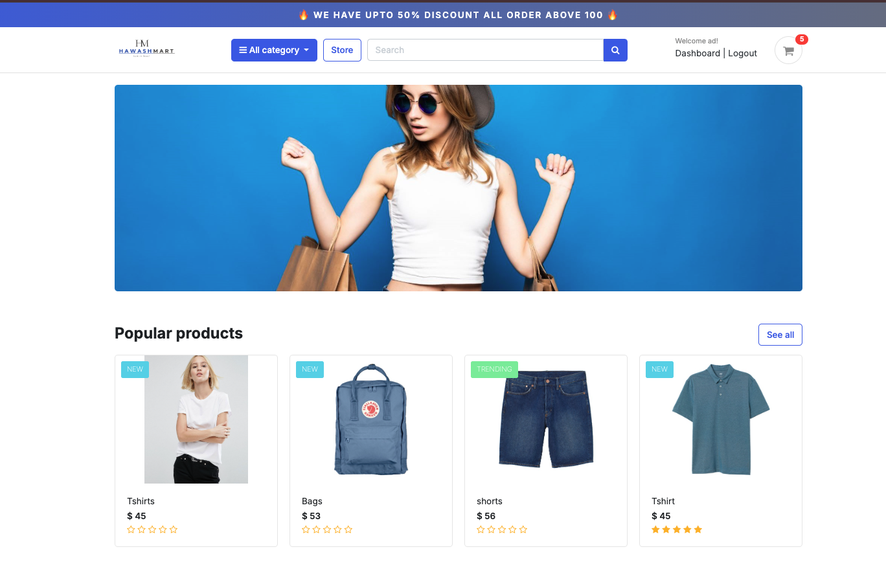
*Hawashmart Home Page - Main landing page with featured products and categories*

## 🛍️ Product Detail
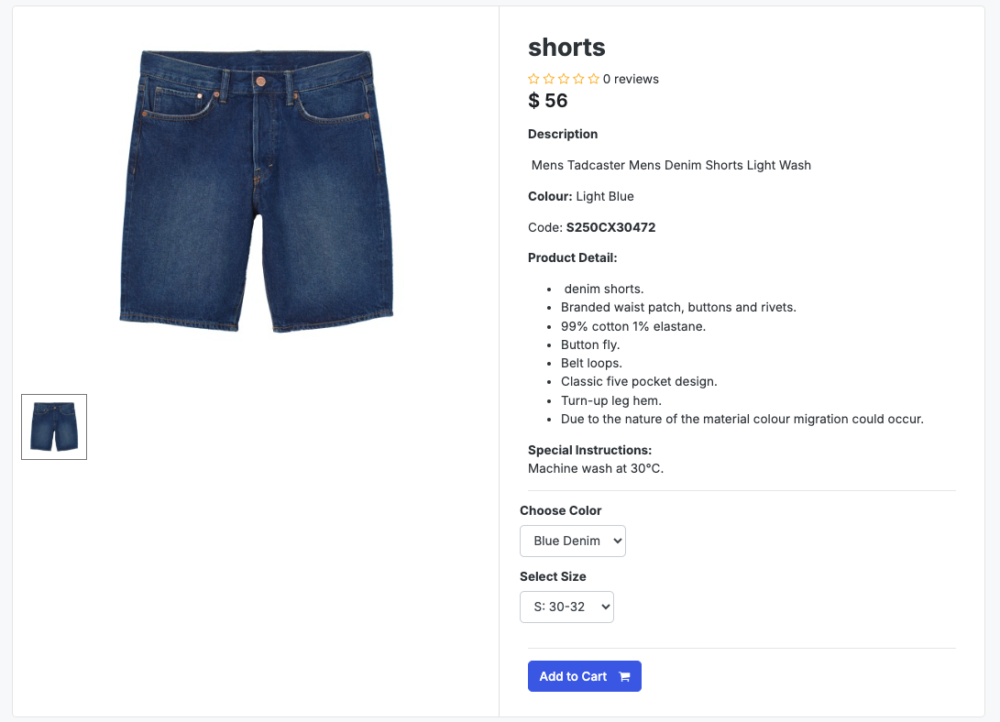
*Product Detail Page - Comprehensive product information with images, reviews, and purchase options*

## 🛒 Shopping Cart
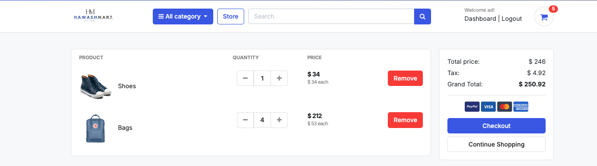
*Shopping Cart - User-friendly cart interface with item management and checkout options*

## 💳 Checkout Process
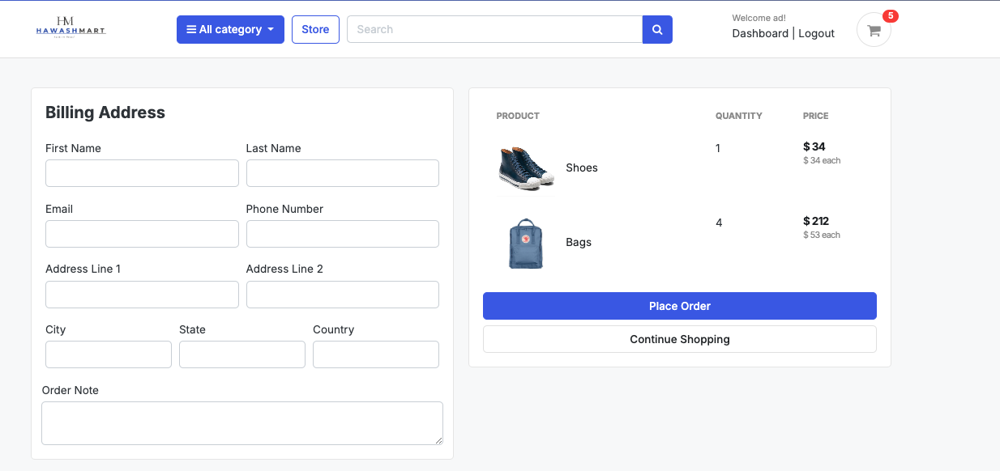
*Checkout Process - Streamlined checkout flow with order summary and payment options*

## 📋 Order History
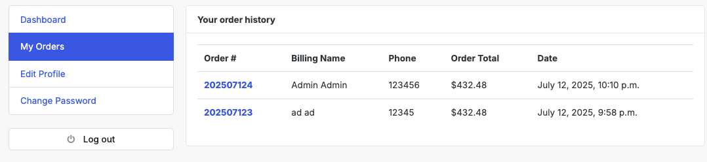
*Order History - Complete order tracking and history management for users*

## 💰 Payment Integration
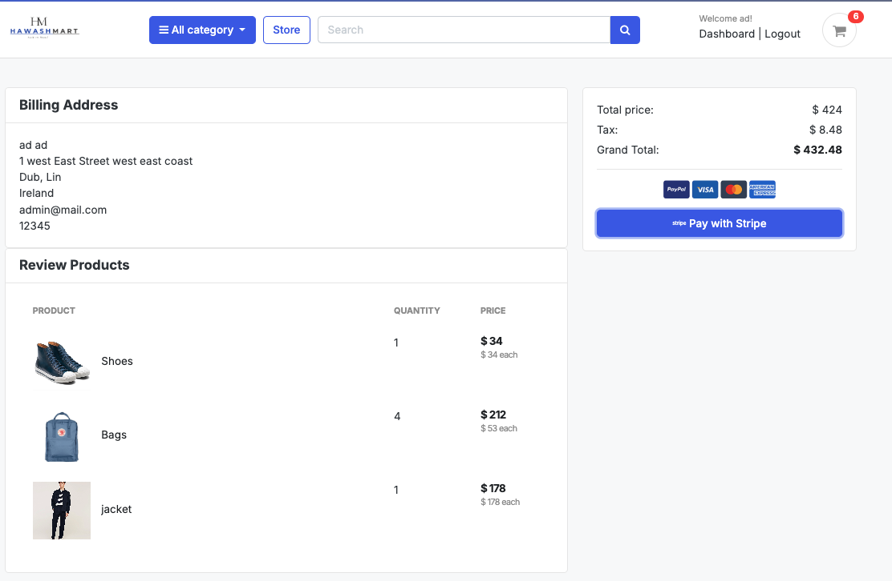
*Stripe Payment Integration - Secure payment processing with multiple payment methods*

## ⭐ Reviews & Ratings
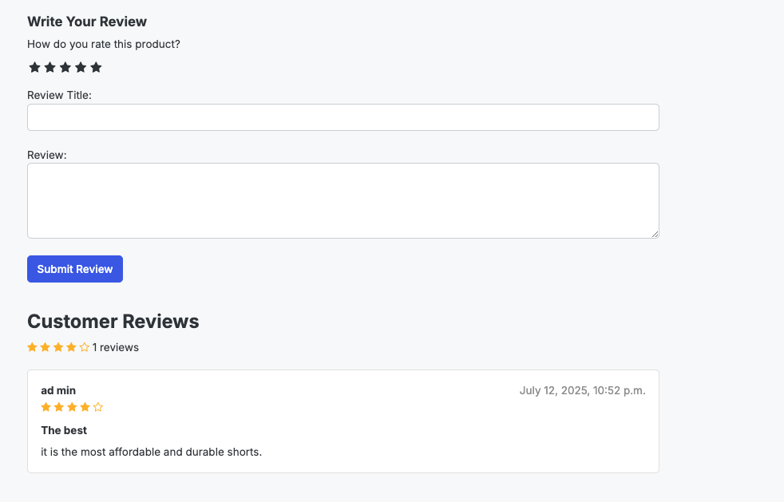
*Reviews - Comprehensive product review and rating functionality*

## ⚙️ Admin Panel
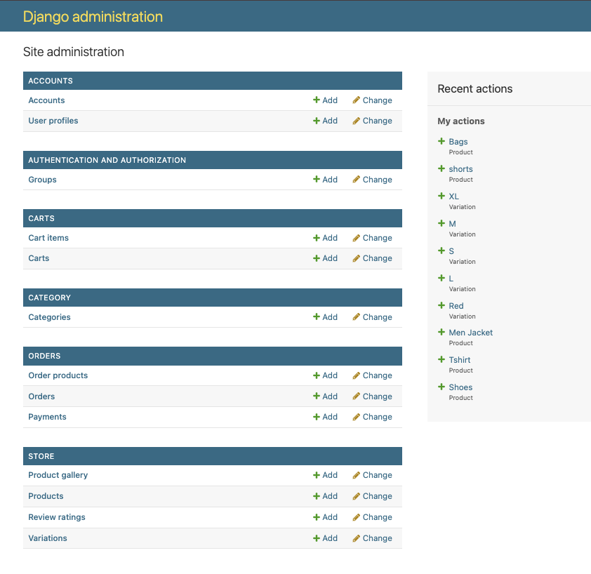
*Admin Panel - Comprehensive Django admin interface for store management*

## 📘 Social Media - Facebook

*Hawashmart Facebook Page - Official Facebook business page with product showcases and community engagement*

## 💳 Checkout Process - Alternative View
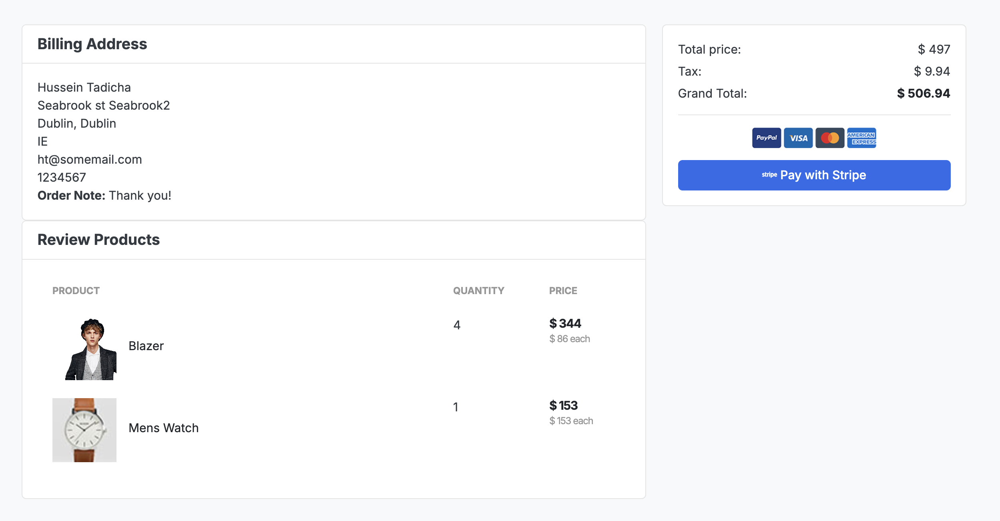
*Checkout Process Alternative View - Additional checkout interface with enhanced payment options*

## 📊 Order Dashboard
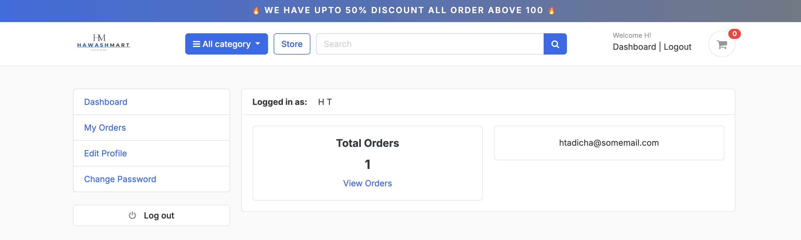
*Order Dashboard - Comprehensive order management and tracking dashboard for administrators*

## ✅ Payment Success
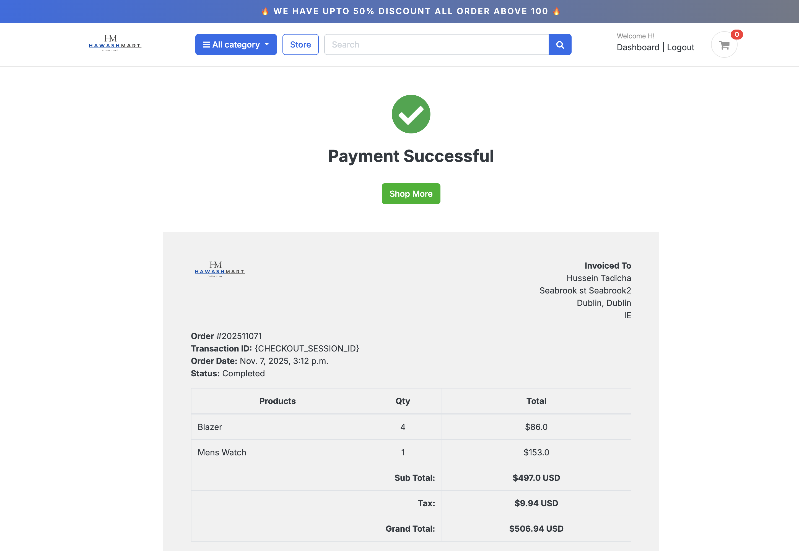
*Payment Success - Payment confirmation screen after successful transaction completion*

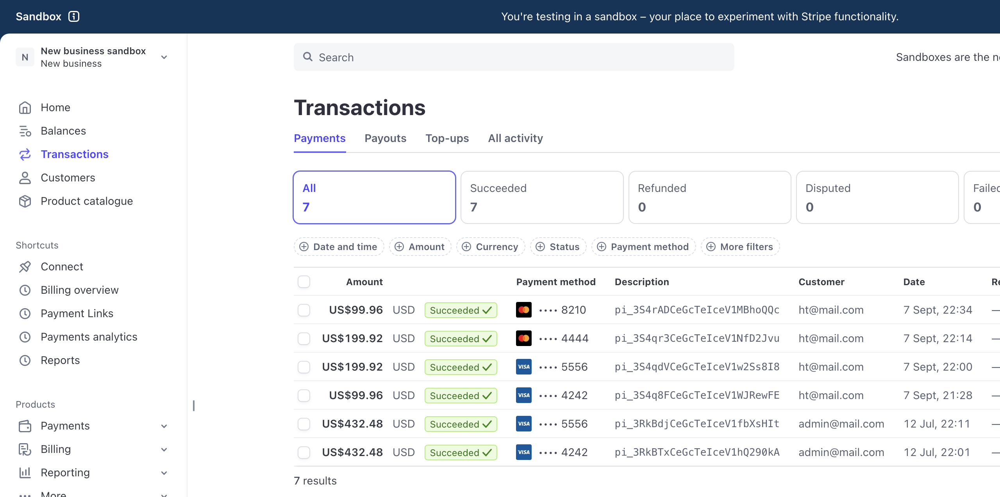
*Stripe Transaction History - Transaction history and payment confirmation details*

## 🔐 Stripe Payment Gateway
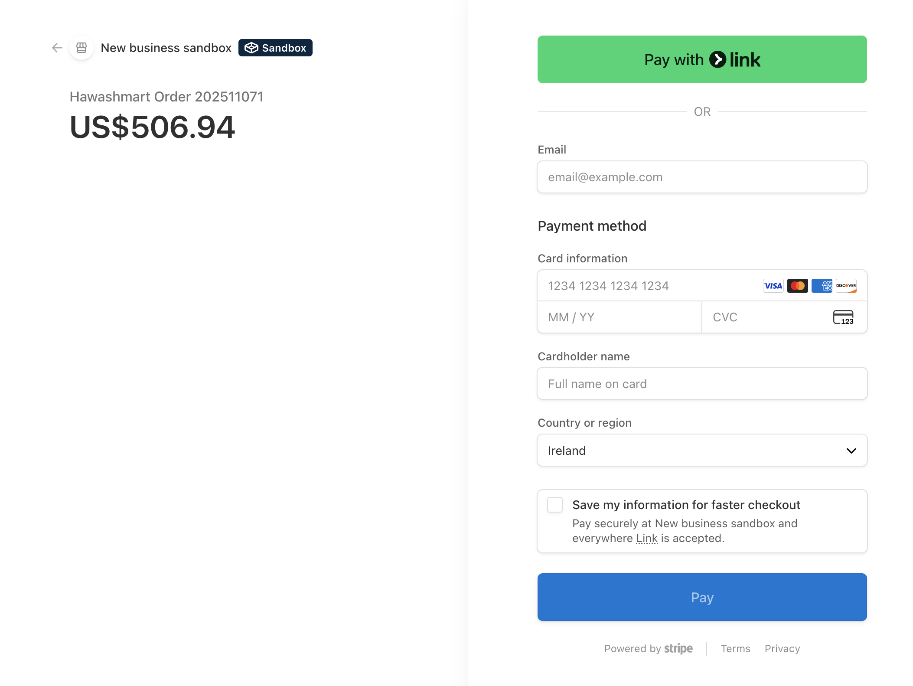
*Stripe Payment Gateway - Detailed view of Stripe payment gateway integration and processing*

## 🎨 Hawashmart Logo

*Hawashmart Logo - Official project logo and branding*

---

## 📊 Image Summary

| Image | Description | Path |
|-------|-------------|------|
| Home Page | Main landing page with featured products | `static/images/home_page.png` |
| Product Detail | Product information with reviews | `static/images/product_detail.png` |
| Shopping Cart | Cart interface with item management | `static/images/cart.png` |
| Checkout Process | Streamlined checkout flow | `static/images/checkout.png` |
| Order History | Order tracking and history | `static/images/order_history.png` |
| Stripe Payment | Payment processing integration | `static/images/Stripe_payment.png` |
| Reviews | Product review functionality | `static/images/reviews.png` |
| Admin Panel | Django admin interface | `static/images/admin_panel.png` |
| Facebook Page | Social media business page | `static/images/fb_page.png` |
| Checkout Alternative | Additional checkout interface | `static/images/checkout2.png` |
| Order Dashboard | Order management dashboard | `static/images/order_dashboard.png` |
| Payment Success | Payment confirmation screen | `static/images/payment_success.png` |
| Stripe Transaction History | Transaction history and payment details | `static/images/stripe_transaction_history.png` |
| Stripe Gateway | Stripe payment gateway view | `static/images/stripe_payment_gateway.png` |
| Logo | Official project logo | `static/images/logo.png` |
