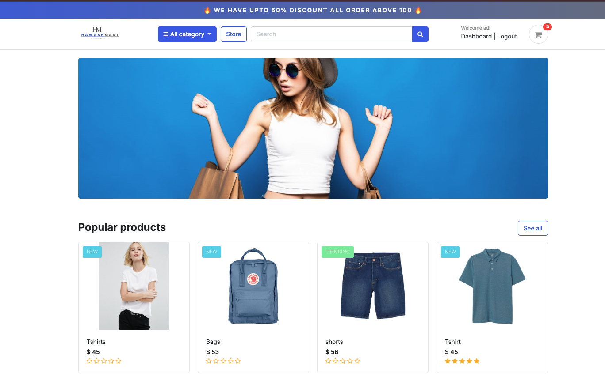
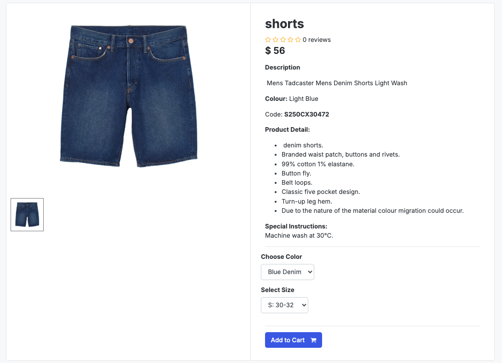
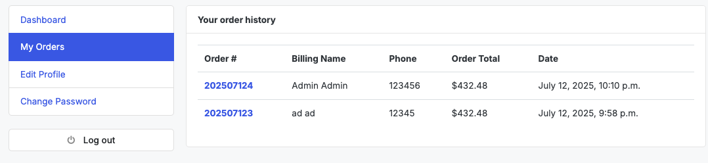
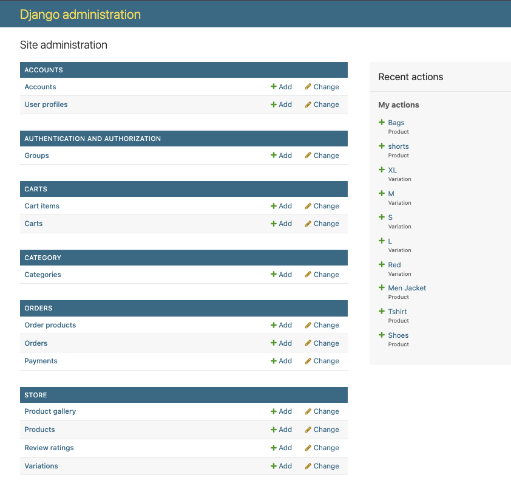

# 📸 Hawashmart Project Images

This file contains all the image references used in the README.md documentation.

## 🏠 Home Page

*Hawashmart Home Page - Main landing page with featured products and categories*

## 🛍️ Product Detail

*Product Detail Page - Comprehensive product information with images, reviews, and purchase options*

## 🛒 Shopping Cart

*Shopping Cart - User-friendly cart interface with item management and checkout options*

## 💳 Checkout Process

*Checkout Process - Streamlined checkout flow with order summary and payment options*

## 📋 Order History

*Order History - Complete order tracking and history management for users*

## 💰 Payment Integration

*Stripe Payment Integration - Secure payment processing with multiple payment methods*

## ⭐ Reviews & Ratings

*Reviews - Comprehensive product review and rating functionality*

## ⚙️ Admin Panel

*Admin Panel - Comprehensive Django admin interface for store management*

## 📘 Social Media - Facebook

*Hawashmart Facebook Page - Official Facebook business page with product showcases and community engagement*

---

## 📊 Image Summary

| Image | Description | Path |
|-------|-------------|------|
| Home Page | Main landing page with featured products | `static/images/home_page.png` |
| Product Detail | Product information with reviews | `static/images/product_detail.png` |
| Shopping Cart | Cart interface with item management | `static/images/Cart.png` |
| Checkout Process | Streamlined checkout flow | `static/images/checkout.png` |
| Order History | Order tracking and history | `static/images/order_history.png` |
| Stripe Payment | Payment processing integration | `static/images/stripe_payment.png` |
| Reviews | Product review functionality | `static/images/reviews.png` |
| Admin Panel | Django admin interface | `static/images/admin_panel.png` |
| Facebook Page | Social media business page | `static/images/fb-page.png` |
